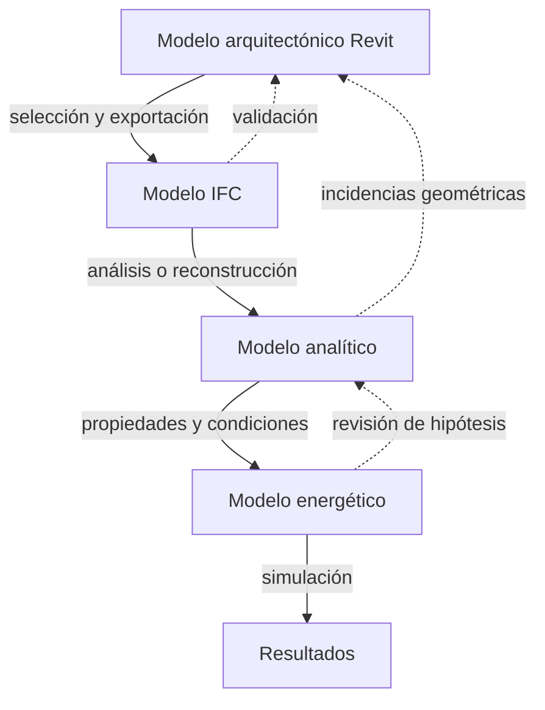

# Del modelo arquitectónico al modelo energético

Un modelo arquitectónico puede ser correcto para producir planos, mediciones o visualizaciones y, sin embargo, resultar inadecuado para una simulación energética. La diferencia no depende únicamente de la cantidad de información: depende de si la geometría y sus relaciones permiten reconocer de forma inequívoca los volúmenes de cálculo, la envolvente, los intercambios entre recintos y las condiciones de contorno.

El objetivo de la preparación no es trasladar una copia completa de Revit al programa de cálculo. El objetivo es obtener un modelo **geométricamente continuo, térmicamente interpretable, suficientemente sencillo y trazable**.

!!! info "Estado de la página"
    Los conceptos relacionados con Open BIM Analytical Model y TeKton3D están confirmados mediante documentación oficial. Su aplicación detallada a Revit 2026 se completará mediante documentación del exportador IFC y pruebas controladas.

## 1. Los modelos que intervienen

### 1.1 Modelo arquitectónico

Es el modelo nativo creado en Revit para representar y documentar el edificio. Contiene elementos constructivos, habitaciones, información gráfica, familias, fases, opciones, vínculos y datos de proyecto.

Su lógica responde principalmente a cómo se diseña y documenta la arquitectura. Por ello puede incluir:

- Capas de acabado modeladas por separado.
- Elementos decorativos o auxiliares.
- Geometrías con un nivel de detalle superior al requerido por el cálculo.
- Recintos divididos por razones funcionales que podrían compartir condiciones térmicas.
- Espacios que no están definidos porque no eran necesarios para la documentación.
- Elementos que cierran visualmente un recinto, pero no lo delimitan computacionalmente.

El modelo arquitectónico es la fuente de información, pero no debe confundirse con el modelo de cálculo.

### 1.2 Modelo de intercambio IFC

Es la representación exportada desde Revit mediante un esquema IFC y una configuración concreta. Contiene geometría, estructura espacial, clases, relaciones y propiedades seleccionadas durante la exportación.

El IFC cumple tres funciones en este flujo:

1. Transportar la geometría arquitectónica relevante.
2. Identificar elementos y recintos mediante entidades normalizadas.
3. Servir como referencia estable para generar o reconstruir el modelo analítico.

Un IFC que puede abrirse correctamente en un visor no es necesariamente apto para análisis energético. La visualización confirma que existe geometría, pero no demuestra que los espacios estén cerrados, que las superficies tengan colindancias correctas o que los huecos estén asociados al cerramiento adecuado.

### 1.3 Modelo analítico

Es una abstracción de la geometría arquitectónica orientada a describir los intercambios térmicos y, cuando procede, acústicos. Sus entidades fundamentales son:

- **Espacios:** volúmenes de cálculo.
- **Superficies:** límites de los espacios y vectores de transferencia.
- **Huecos:** partes diferenciadas dentro de superficies opacas.
- **Aristas:** encuentros entre superficies.
- **Colindancias:** relaciones entre límites de espacios contiguos.
- **Sombras:** superficies que modifican la radiación incidente sin formar parte de la transmisión térmica del recinto.

Open BIM Analytical Model genera estos componentes mediante el análisis de los recintos y elementos arquitectónicos contenidos en el IFC. El usuario puede editar el resultado, corregir colindancias, dividir o unir superficies y ajustar espacios.

TeKton3D permite otra estrategia: importar determinadas entidades IFC como elementos nativos o vincular el IFC como referencia y construir sobre él un modelo analítico simplificado. La documentación de iMventa recomienda habitualmente esta segunda opción para que el técnico controle la simplificación.

### 1.4 Modelo energético

Es el modelo que finalmente interpreta el motor de cálculo. Añade al modelo analítico información que no puede deducirse únicamente de la forma del edificio:

- Soluciones constructivas y propiedades térmicas.
- Condiciones operacionales.
- Zonificación térmica.
- Perfiles de ocupación, iluminación y equipos.
- Ventilación e infiltración.
- Sistemas de climatización y ACS.
- Datos climáticos.
- Parámetros reglamentarios y opciones de simulación.

El modelo energético puede reorganizar los recintos arquitectónicos. Un espacio arquitectónico puede dividirse en varias zonas cuando existen condiciones diferentes; varios espacios pueden agruparse cuando comparten uso, horarios, sistema y comportamiento térmico.

### 1.5 Resultados y documentación

El último nivel corresponde a los resultados calculados y a los documentos reglamentarios o de análisis: demandas, consumos, emisiones, indicadores, verificaciones, certificados y archivos de intercambio administrativo.

Estos resultados solo son reproducibles si se conservan las versiones del modelo fuente, la configuración IFC, el modelo analítico, el modelo energético, el motor y sus datos de entrada.

## 2. Relación entre los modelos

El flujo no es estrictamente lineal. La generación del modelo analítico suele revelar errores que deben corregirse en Revit: habitaciones abiertas, huecos ausentes, elementos duplicados, límites falsos o encuentros discontinuos. Corregir únicamente el modelo receptor puede resolver una entrega puntual, pero no elimina el problema del modelo fuente ni garantiza que la siguiente actualización sea consistente.

## 3. Espacio arquitectónico, espacio analítico y zona térmica

### 3.1 Espacio arquitectónico

Representa un recinto identificado por criterios de diseño, uso o documentación. En Revit se materializa habitualmente mediante habitaciones o espacios MEP.

### 3.2 Espacio analítico

Es un volumen cerrado limitado por superficies que el proceso de análisis puede relacionar con exterior, terreno u otros espacios. Habitualmente coincide con un recinto arquitectónico, pero no existe obligación de correspondencia uno a uno.

### 3.3 Zona térmica

Es una unidad de simulación formada por uno o varios espacios que comparten criterios suficientes para calcularse conjuntamente. La agrupación debe considerar, como mínimo:

- Uso y condiciones operacionales.
- Horarios.
- Temperaturas de consigna.
- Sistema que atiende el espacio.
- Orientación y comportamiento de la envolvente cuando sean determinantes.
- Unidad de uso o alcance reglamentario.

No debe suponerse que una habitación de Revit equivale automáticamente a una zona térmica.

## 4. Superficies y condiciones de contorno

Una superficie analítica representa una porción del límite de un espacio. Para que resulte útil debe conocerse:

- El espacio al que pertenece.
- Si es opaca o acristalada.
- Si forma parte de un hueco.
- Su disposición, orientación e inclinación.
- Su área y perímetro.
- El medio o espacio situado al otro lado.
- La superficie colindante cuando separa dos espacios.

Las condiciones de contorno habituales son:

- Aire exterior.
- Terreno.
- Otro espacio acondicionado.
- Otro espacio no acondicionado.
- Medianería o condición adiabática, cuando el procedimiento lo justifique.

Una superficie sin condición de contorno inequívoca puede generar pérdidas, ganancias o adyacencias incorrectas aunque su posición visual parezca adecuada.

## 5. Aristas, encuentros y puentes térmicos

Las aristas describen la convergencia entre superficies. En un modelo analítico permiten relacionar encuentros de fachada con forjados, cubiertas, huecos y otros elementos.

Su utilidad depende del programa receptor. Open BIM Analytical Model puede generar y relacionar aristas para que aplicaciones posteriores interpreten uniones y transmisiones laterales. TeKton3D detecta determinados puentes térmicos a partir de la geometría, los cerramientos próximos y las soluciones constructivas asignadas.

Por ello, pequeñas discontinuidades, superficies duplicadas o encuentros fragmentados pueden alterar no solo el área de la envolvente, sino también la longitud y clasificación de los puentes térmicos.

## 6. Sombras

Los elementos de sombra influyen en la radiación solar sin ser necesariamente parte de la envolvente térmica. Deben distinguirse:

- **Sombras propias:** aleros, vuelos, retranqueos, lamas y otros elementos del edificio.
- **Sombras remotas:** edificios próximos u obstáculos exteriores.

Exportar toda la geometría exterior puede volver el modelo innecesariamente pesado. Deben conservarse únicamente los obstáculos con influencia significativa, utilizando una representación geométrica proporcionada al análisis.

## 7. Principio de modelo mínimo, suficiente y calculable

El modelo preparado debe cumplir simultáneamente tres condiciones:

### Mínimo

No incluye detalle sin influencia apreciable en el análisis ni geometría que dificulte el reconocimiento de espacios y superficies.

### Suficiente

Contiene todos los recintos, límites, huecos, sombras y referencias necesarias para reproducir el comportamiento térmico relevante.

### Calculable

Puede transformarse en un conjunto coherente de zonas y superficies compatible con las reglas geométricas del motor de cálculo.

La simplificación no consiste en eliminar indiscriminadamente. Consiste en conservar el efecto térmico con la geometría más robusta posible.

## 8. Criterios para decidir dónde corregir

| Incidencia | Corrección preferente |
|---|---|
| Habitación abierta o sin volumen | Revit |
| Muro, forjado o cubierta duplicados | Revit |
| Hueco que no corta el cerramiento | Revit o familia de Revit |
| Clasificación IFC incorrecta y recurrente | Revit o configuración IFC |
| Simplificación específica del cálculo | Modelo analítico o energético |
| Agrupación de espacios en zonas | Modelo analítico o energético, conservando trazabilidad |
| Colindancia puntual mal deducida | Revisar primero Revit; corregir en el analítico si la fuente es válida |
| Obstáculo remoto no modelado en arquitectura | Modelo analítico o energético |

La regla general es corregir en el origen aquello que representa un defecto del edificio modelado y resolver en el receptor aquello que constituye una decisión propia del cálculo.

## 9. Requisitos de trazabilidad

Cada modelo energético aprobado debe poder vincularse con:

- Archivo y versión de Revit.
- Vista y fase de exportación.
- Versión del exportador IFC.
- Configuración, esquema y MVD.
- Archivo IFC publicado.
- Versión del modelo analítico.
- Aplicación y versión del motor.
- Registro de correcciones manuales.
- Fecha y responsable de validación.

Esta trazabilidad permite actualizar el proyecto sin convertir cada simulación en un proceso irrepetible.

## 10. Fuentes principales

- CYPE, *Open BIM Analytical Model. Manual de uso* (`CYPE-OBAM-01`).
- CYPE, *Guía de interoperabilidad CYPE-Revit v2.0* (`CYPE-REVIT-20`).
- iMventa Ingenieros, *Manual TK-CEEP* (`IMVENTA-CEEP`).
- iMventa Ingenieros, *Crear modelo analítico del edificio en TeKton3D a partir de un IFC* (`IMVENTA-IFC-ANALYTICAL`).
