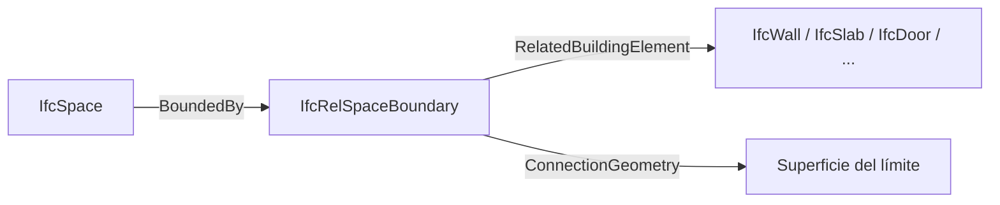
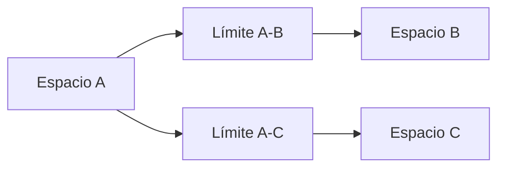

# Espacios, zonas y límites espaciales

Los espacios y sus límites constituyen el vínculo más directo entre el modelo arquitectónico y el modelo térmico. Los elementos constructivos describen qué se ha modelado; los espacios y las relaciones de delimitación permiten interpretar qué volumen existe, qué superficies lo cierran y qué hay al otro lado de cada una.

Este capítulo explica la estructura IFC necesaria para comprender el proceso. No presupone que Revit 2026 exporte toda esta información ni que cada receptor la utilice del mismo modo.

!!! info "Distinción fundamental"
    La geometría de un `IfcSpace`, sus relaciones con elementos delimitadores y los límites térmicos finales son tres capas relacionadas, pero no equivalentes.

## 1. Tres representaciones complementarias

Un recinto puede describirse mediante:

1. **El volumen del espacio:** representación geométrica del `IfcSpace`.
2. **Los elementos que lo delimitan:** muros, losas, cubiertas, puertas, ventanas o elementos virtuales.
3. **Los límites espaciales:** relaciones `IfcRelSpaceBoundary` que identifican qué porción de un elemento delimita el espacio.

Un `IfcSpace` puede tener una geometría correcta aunque no incluya relaciones de límite detalladas. Del mismo modo, pueden existir relaciones lógicas con elementos sin geometría de conexión suficiente para un análisis térmico.

## 2. `IfcSpace`

### 2.1 Significado

`IfcSpace` representa un área o volumen delimitado física o teóricamente y asociado a una función dentro del edificio. Normalmente se integra en la estructura espacial bajo una planta `IfcBuildingStorey`.

Puede representar:

- Una habitación.
- Un espacio MEP.
- Un volumen interior no habitable.
- Un espacio exterior delimitado teóricamente.
- Un espacio compuesto o parcial, según las reglas de composición.

### 2.2 Identificación

Los campos de identificación deben utilizarse de forma consistente:

| Campo IFC | Uso habitual |
|---|---|
| `Name` | Identificador corto o número del recinto. |
| `LongName` | Nombre descriptivo completo. |
| `Description` | Información adicional. |
| `ObjectType` | Categoría funcional o tipo de espacio. |

La correspondencia exacta con número, nombre y parámetros de habitación de Revit debe verificarse en el exportador. Para evitar ambigüedades, el manual definirá una convención que mantenga un identificador estable separado del nombre descriptivo.

### 2.3 Geometría

La geometría del espacio debe representar un volumen cerrado y coherente con el recinto que se pretende analizar. Debe verificarse:

- Cota inferior.
- Cota superior.
- Contorno horizontal.
- Volumen.
- Encuentros con forjados y cubiertas.
- Huecos o penetraciones que no deban abrir el recinto.

buildingSMART indica que, si existe incoherencia entre la geometría del `IfcSpace` y la geometría combinada de los límites espaciales, debe prevalecer la representación del espacio. Esta regla no elimina la necesidad de corregir los límites: evita que una representación secundaria invalide automáticamente el volumen principal.

### 2.4 Alturas y cantidades

IFC permite expresar diferentes alturas:

- Altura total del espacio.
- Cota del acabado de suelo.
- Altura libre hasta falso techo.
- Altura entre elementos estructurales.

Para el modelo energético debe quedar claro qué plano define el volumen térmico. La altura libre arquitectónica no siempre coincide con la altura del volumen analítico, especialmente cuando existen falsos techos, plénums o suelos técnicos.

### 2.5 Interior y exterior

La condición interior/exterior puede expresarse mediante propiedades como `Pset_SpaceCommon.IsExternal`. El receptor puede también deducirla a partir de la posición y las relaciones.

No debe dependerse únicamente del nombre del recinto, por ejemplo “terraza” o “patio”. La condición debe estar codificada o ser geométricamente inequívoca.

## 3. Habitaciones de Revit e `IfcSpace`

Las habitaciones y espacios de Revit son candidatos a exportarse como `IfcSpace`, pero su calidad depende de:

- Fase correcta.
- Estado colocado y cerrado.
- Área distinta de cero.
- Cálculo de volumen activado.
- Límites superior e inferior.
- Elementos `Room Bounding`.
- Inclusión en la vista y configuración de exportación.

La correspondencia no debe darse por supuesta. El control deberá comparar:

| Revit | IFC |
|---|---|
| Número | `Name` u otro campo mapeado |
| Nombre | `LongName` u otro campo mapeado |
| Nivel | Contención en `IfcBuildingStorey` |
| Área | `Qto_SpaceBaseQuantities` o geometría |
| Volumen | Cantidad o volumen geométrico |
| Interior/exterior | Propiedad o regla de clasificación |

Esta tabla se ajustará tras los ensayos con Revit 2026.

## 4. Espacios simples, compuestos y parciales

IFC permite organizar espacios mediante `CompositionType`:

- `ELEMENT`: espacio individual.
- `COMPLEX`: conjunto compuesto.
- `PARTIAL`: parte de un espacio.

En análisis energético, esta flexibilidad debe utilizarse con cautela. Muchos receptores esperan espacios no solapados y directamente calculables. Una estructura compleja puede ser semánticamente válida y, sin embargo, no estar soportada por la aplicación.

La opción más interoperable será normalmente exportar espacios elementales, cerrados y no solapados, y realizar agrupaciones mediante relaciones de zona.

## 5. `IfcZone`

### 5.1 Función

`IfcZone` agrupa espacios según un criterio espacial común. Puede representar:

- Zona térmica.
- Sector de incendio.
- Zona de seguridad.
- Unidad funcional.
- Agrupación de climatización.

El nombre de la entidad no implica que sea térmica. El propósito debe quedar definido mediante nombre, clasificación o convención del proyecto.

### 5.2 Varias agrupaciones simultáneas

Un mismo espacio puede pertenecer a agrupaciones diferentes según el uso. Por ejemplo:

- Unidad de uso.
- Zona térmica.
- Sector de incendio.
- Área de mantenimiento.

Open BIM Analytical Model permite crear distintas agrupaciones de espacios sobre el mismo modelo. Esta capacidad es coherente con la idea de que la zonificación no debe destruir la estructura básica de recintos.

### 5.3 Convención `ZoneName`

Determinados exportadores o flujos utilizan un parámetro denominado `ZoneName` para agrupar habitaciones o espacios. Debe tratarse como una convención de implementación con reglas explícitas:

- Tipo de parámetro.
- Categorías aplicables.
- Formato del código.
- Unicidad.
- Receptor previsto.

No debe emplearse el mismo valor para finalidades incompatibles.

## 6. `IfcRelSpaceBoundary`

### 6.1 Función

`IfcRelSpaceBoundary` relaciona un espacio con el elemento que lo delimita. Es una relación uno a uno entre:

- Un espacio.
- Un elemento delimitador.
- Una porción concreta del límite, cuando se incluye geometría.

Un elemento puede participar en múltiples relaciones porque puede delimitar varios espacios o porque su superficie se divide en varias porciones.

### 6.2 Elemento relacionado

El límite puede estar proporcionado por:

- Muro.
- Losa o forjado.
- Cubierta.
- Puerta.
- Ventana.
- Elemento de apertura.
- Elemento virtual.
- Otro elemento compatible con el esquema y la vista.

La relación debe apuntar al elemento que explica físicamente o virtualmente el límite.

### 6.3 Límite físico

Un límite físico corresponde a un elemento real. La relación identifica el cerramiento que separa el espacio de otro espacio o del entorno.

Ejemplos:

- Cara interior de un muro de fachada.
- Cara superior de un suelo.
- Cara inferior de una cubierta.
- Superficie de una partición entre recintos.

### 6.4 Límite virtual

Un límite virtual separa espacios sin que exista un cerramiento físico completo. Puede estar relacionado con `IfcVirtualElement` o con una apertura, según la situación y el esquema.

Ejemplos:

- Línea separadora entre dos áreas abiertas.
- División funcional dentro de un gran recinto.
- Conexión abierta que se conserva como frontera analítica.

Los límites virtuales requieren especial atención porque el motor puede necesitar intercambio de aire, transferencia térmica equivalente o agrupación de los espacios.

## 7. Límites internos y externos

La relación distingue entre límites internos y externos:

- **Interno:** existe otro espacio o condición interior al otro lado.
- **Externo:** está expuesto a exterior o a un espacio exterior definido.

Esta clasificación debe ser coherente con la geometría y con la superficie colindante. Un muro entre dos habitaciones no debe convertirse en límite exterior porque una de las habitaciones no se haya exportado.

La ausencia de un espacio adyacente puede cambiar la interpretación de todas las superficies que lo rodean.

## 8. Primer nivel

Los límites de primer nivel describen qué elementos delimitan el espacio sin considerar detalladamente los cambios de elementos o espacios situados al otro lado.

Son adecuados para:

- Coordinación arquitectónica.
- Gestión de recintos.
- Relación básica espacio-elemento.
- Cálculos que no necesiten descomposición térmica detallada.

Su principal limitación para análisis energético es que una única superficie interior puede necesitar subdividirse por diferencias existentes al otro lado.

## 9. Segundo nivel

Los límites de segundo nivel consideran las variaciones del elemento delimitador y de los espacios adyacentes. buildingSMART distingue:

- **Tipo 2a:** existe un espacio al otro lado.
- **Tipo 2b:** existe un elemento constructivo al otro lado, pero no un espacio correspondiente.

En una vista térmica, la descomposición debe responder a los cambios de material y a los espacios adyacentes. Esto permite representar con mayor precisión:

- Particiones entre zonas.
- Tramos de fachada asociados a distintos espacios.
- Cambios de construcción.
- Porciones opacas y huecos.
- Encuentros con espacios no modelados.

### 9.1 Ejemplo de subdivisión

Un muro continuo puede delimitar dos habitaciones en la planta contigua. Para coordinación puede ser un único elemento; para cálculo, la superficie del espacio debe dividirse porque cada porción tiene una adyacencia diferente.

### 9.2 Alcance de la vista de intercambio

El esquema define las entidades, pero la forma exacta de descomponer límites depende de la MVD y de los acuerdos de implementación. No debe afirmarse que un archivo contiene límites de segundo nivel únicamente porque utiliza IFC4.

## 10. Geometría de conexión

`ConnectionGeometry` puede representar geométricamente la porción del límite. Se expresa en el sistema local del espacio y puede utilizar superficies planas, curvas o modelos facetados admitidos por la especificación.

Para análisis térmico interesa comprobar:

- Que la geometría está presente cuando el receptor la requiere.
- Que el contorno es cerrado.
- Que la superficie coincide con el límite real del espacio.
- Que huecos y recortes están correctamente representados.
- Que no existen superficies superpuestas.
- Que las superficies adyacentes son compatibles.

Una relación sin geometría puede ser útil semánticamente, pero insuficiente para generar directamente una superficie de cálculo.

## 11. Colindancia entre espacios

Una adyacencia térmica correcta necesita dos caras relacionadas con el mismo límite físico. Debe comprobarse:

1. Espacio de cada lado.
2. Elemento separador.
3. Área compartida.
4. Orientaciones opuestas.
5. Clasificación interna.
6. Construcción asociada.

Cuando las superficies no coinciden exactamente, el generador analítico puede:

- Subdividirlas.
- Ajustar tolerancias.
- Marcar una incidencia.
- Interpretar parte como exterior.
- No generar la relación.

Por eso las pequeñas diferencias geométricas pueden tener un impacto mayor que su tamaño aparente.

## 12. Huecos y límites espaciales

Un hueco introduce una relación entre:

- Espacio.
- Superficie opaca base.
- Apertura geométrica.
- Puerta, ventana o lucernario.

El área del hueco debe descontarse o diferenciarse de la superficie opaca según las reglas del receptor. Los principales fallos son:

- Hueco visible pero no relacionado con el muro.
- Familia que no corta al hospedante.
- Hueco fuera del contorno de la superficie.
- Puerta acristalada clasificada como opaca.
- Ventana asociada a una zona diferente.
- Hueco duplicado por representaciones superpuestas.

## 13. Falsos techos, plénums y suelos técnicos

Estos elementos obligan a decidir qué volumen se analiza:

- Si el falso techo delimita la habitación, puede reducir el volumen y ocultar el forjado superior como límite.
- Si el plénum se modela como espacio separado, necesita sus propias superficies y condiciones.
- Si no se analiza por separado, debe formar parte de una zona o resolverse mediante la hipótesis admitida por el motor.

No existe una regla única para todos los edificios. La decisión debe responder al uso, ventilación del plénum, sistemas y relevancia térmica.

## 14. Dobles alturas y conexiones verticales

Las dobles alturas, escaleras y atrios pueden atravesar varias plantas. Los riesgos más habituales son:

- Espacios superpuestos.
- Límites horizontales ficticios.
- Volúmenes abiertos.
- Separación en plantas sin correspondencia térmica.
- Contornos anulares complejos.

Debe decidirse si se utiliza:

- Un espacio continuo.
- Varios espacios conectados.
- Una zona térmica que agrupa varios espacios.

La elección debe ser compatible con el receptor y conservar las superficies exteriores correctas.

## 15. Espacios no habitables

Patinillos, cámaras, aparcamientos, trasteros, áticos y espacios bajo cubierta pueden influir en la envolvente aunque no estén acondicionados.

Las estrategias posibles son:

1. Modelarlos como espacios independientes.
2. Agruparlos como zona no habitable.
3. Representarlos mediante una condición de contorno equivalente.
4. Simplificarlos dentro de otro espacio cuando su influencia sea despreciable y el procedimiento lo permita.

Omitirlos sin una estrategia puede convertir particiones interiores en fachadas exteriores o perder superficies de intercambio.

## 16. Qué hace Open BIM Analytical Model

Según su manual, el proceso automático utiliza los recintos y elementos arquitectónicos del IFC para crear:

- Espacios.
- Superficies.
- Aristas.
- Colindancias.
- Uniones.
- Sombras, si se activa la opción.

Puede utilizar los contornos de espacios definidos en el IFC cuando están correctamente determinados. El usuario conserva control sobre el resultado y puede editar espacios, superficies y colindancias.

Por tanto, el IFC debe facilitar la generación, pero el resultado analítico debe revisarse antes de publicarlo hacia CYPETHERM.

## 17. Qué hace TeKton3D

En el flujo de importación, TK-IFC intenta convertir determinados elementos arquitectónicos, incluidos espacios, a entidades nativas.

En el flujo de vinculación, el IFC se utiliza como referencia para dibujar espacios simplificados y generar sobre ellos la envolvente. Este segundo método reduce la dependencia de límites espaciales exportados, pero aumenta la responsabilidad del técnico al reconstruir el modelo.

## 18. Matriz de comprobación

| Comprobación | Revit | IFC | Modelo analítico |
|---|---:|---:|---:|
| Habitación colocada | Sí | — | — |
| Recinto cerrado | Sí | Verificar volumen | Verificar espacio |
| Altura correcta | Sí | Verificar geometría | Verificar volumen |
| Planta correcta | Sí | `IfcBuildingStorey` | Vista y referencia |
| Límite físico | Elemento `Room Bounding` | Relación o geometría | Superficie |
| Límite virtual | Separador o decisión | `IfcVirtualElement`/relación | División analítica |
| Adyacencia | Geometría compatible | Puede estar definida | Debe validarse |
| Interior/exterior | Función y posición | Propiedad o relación | Condición de contorno |
| Zona térmica | Parámetro opcional | `IfcZone` o convención | Grupo de espacios |

## 19. Criterios de aceptación

Un conjunto de espacios podrá aceptarse como base para generación analítica cuando:

- [ ] Todos los recintos relevantes están presentes.
- [ ] No existen espacios no colocados, redundantes o con volumen cero.
- [ ] Cada espacio pertenece a la planta correcta.
- [ ] Los volúmenes son cerrados y no se solapan involuntariamente.
- [ ] Las alturas y cotas representan el volumen que se pretende analizar.
- [ ] Los espacios no habitables tienen una estrategia definida.
- [ ] Los límites internos y externos son deducibles.
- [ ] Los huecos se asocian a superficies base.
- [ ] Las adyacencias principales se generan correctamente.
- [ ] Las correcciones manuales quedan registradas.

## 20. Pruebas necesarias con Revit 2026

Se preparará un modelo de ensayo que incluya:

1. Dos habitaciones adyacentes.
2. Habitación con falso techo.
3. Doble altura.
4. Espacio no habitable.
5. Separador de habitación sin muro.
6. Puerta, ventana y lucernario.
7. Solera, cubierta y forjado entre plantas.
8. Habitación exterior no exportable.
9. Agrupación mediante `ZoneName`.

Se compararán las exportaciones IFC2x3 e IFC4 para registrar:

- Campos de identificación.
- Geometría de `IfcSpace`.
- Cantidades.
- Condición exterior.
- Relaciones de límites.
- Resultado en Open BIM Analytical Model.
- Resultado de importación o vinculación en TeKton3D.

## 21. Fuentes principales

- buildingSMART International, `IfcSpace`.
- buildingSMART International, `IfcZone`.
- buildingSMART International, `IfcRelSpaceBoundary`.
- buildingSMART International, *Space Boundaries 1st Level*.
- CYPE, *Open BIM Analytical Model. Manual de uso* (`CYPE-OBAM-01`).
- iMventa Ingenieros, *Crear modelo analítico del edificio en TeKton3D a partir de un IFC* (`IMVENTA-IFC-ANALYTICAL`).
