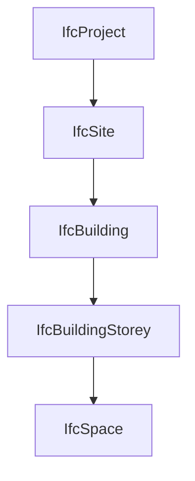

# IFC aplicado al análisis energético

IFC es un estándar abierto para compartir información de activos construidos. Define un esquema de datos, documentación, conjuntos de propiedades y cantidades, y mecanismos de serialización. En este manual se utiliza como medio de intercambio entre Revit y las aplicaciones que generan o consumen modelos analíticos y energéticos.

El uso de IFC no garantiza por sí mismo que un edificio sea calculable. La calidad del intercambio depende de cuatro capas:

1. Versión del esquema IFC.
2. Model View Definition o reglas de implementación.
3. Configuración y capacidad del exportador.
4. Interpretación realizada por la aplicación receptora.

!!! warning "IFC válido no equivale a modelo energético válido"
    Un archivo puede cumplir la sintaxis IFC y visualizarse correctamente, pero carecer de recintos cerrados, límites espaciales utilizables, clasificaciones coherentes o relaciones suficientes para generar el modelo analítico.

## 1. Esquema, serialización y MVD

### 1.1 Esquema IFC

El esquema define las clases, atributos, tipos y relaciones que pueden utilizarse. Las denominaciones habituales —IFC2x3, IFC4 e IFC4.3— corresponden a versiones del esquema, no a configuraciones de exportación equivalentes.

Cambiar de IFC2x3 a IFC4 puede modificar:

- Entidades y atributos disponibles.
- Tipos predefinidos.
- Representaciones geométricas admitidas.
- Conjuntos de propiedades.
- Reglas y acuerdos de implementación.
- Compatibilidad del receptor.

La versión más reciente no es automáticamente la más adecuada. Debe elegirse la versión que el receptor pueda interpretar para el uso previsto.

### 1.2 Serialización

El formato de archivo más habitual es IFC-SPF, basado en STEP Physical File. Es el archivo de texto con extensión `.ifc` que se intercambia normalmente. La serialización es distinta del esquema: dos archivos pueden usar el mismo esquema y representarse mediante mecanismos diferentes.

Para los flujos estudiados, la comprobación se centrará inicialmente en archivos `.ifc` generados desde Revit.

### 1.3 Model View Definition

Una MVD define cómo utilizar una parte del esquema para un caso de intercambio. buildingSMART advierte que no es un simple filtro: determina qué información debe incluirse, excluirse y cómo deben estructurarse entidades, propiedades y relaciones.

Por tanto, deben registrarse siempre por separado:

- Esquema: por ejemplo, IFC4.
- MVD o configuración equivalente: por ejemplo, Reference View.
- Exportador y versión.
- Opciones activadas.

Decir únicamente “se exportó en IFC4” no permite reproducir el intercambio.

### 1.4 Reference View

IFC4 Reference View está orientada principalmente al intercambio de modelos de referencia para coordinación. Puede constituir una base adecuada para transportar la arquitectura hacia un generador analítico, pero no debe suponerse que contenga por defecto todos los datos necesarios para un análisis térmico.

En particular, será necesario verificar si el flujo transporta o reconstruye:

- Recintos.
- Contornos de espacios.
- Límites espaciales.
- Colindancias.
- Condiciones interior/exterior.
- Huecos.
- Propiedades necesarias para el mapeado.

## 2. Estructura espacial

La estructura espacial organiza el modelo como una jerarquía. Para edificación, una estructura habitual es:

Los niveles `IfcSite` e `IfcSpace` pueden ser opcionales según el esquema y la vista de intercambio, pero para este flujo cumplen funciones importantes:

- `IfcSite`: ubicación, referencia y contexto exterior.
- `IfcBuilding`: edificio objeto del análisis.
- `IfcBuildingStorey`: organización por plantas y cotas.
- `IfcSpace`: recintos o volúmenes funcionales.

### 2.1 Agregación y contención

La jerarquía espacial se construye mediante relaciones, no únicamente mediante nombres:

- `IfcRelAggregates` descompone proyecto, sitio, edificio, plantas y espacios.
- `IfcRelContainedInSpatialStructure` asigna elementos físicos a un contenedor espacial.

Un muro puede visualizarse en la cota correcta y, sin embargo, estar contenido en una planta equivocada. Esto afecta a filtros, selección de aportaciones y procesos de generación que dependen de la estructura espacial.

### 2.2 Plantas

`IfcBuildingStorey` representa las plantas de la estructura espacial. No todos los niveles auxiliares de Revit deben convertirse en plantas IFC. Una proliferación de niveles de referencia puede producir plantas innecesarias, elementos mal contenidos o recintos fragmentados.

La correspondencia entre niveles de Revit e `IfcBuildingStorey` se desarrollará en el capítulo de estructura vertical.

## 3. Espacios y zonas

### 3.1 `IfcSpace`

`IfcSpace` representa un área o volumen delimitado física o teóricamente que cumple una función dentro del edificio. Puede estar asociado a una planta y actuar como contenedor espacial de elementos relacionados con el recinto.

Para análisis energético interesa comprobar:

- Identificador y nombre.
- Planta y posición.
- Representación geométrica.
- Área, altura y volumen cuando se exportan.
- Clasificación interior/exterior.
- Relaciones con elementos delimitadores.
- Límites espaciales disponibles.

La documentación IFC distingue entre `Name`, `LongName` y `ObjectType`. El exportador puede mapear número, nombre y tipo de habitación a campos distintos; no debe suponerse que todos los receptores muestran el mismo campo como referencia principal.

### 3.2 Geometría del espacio

La geometría del `IfcSpace` puede servir como base para generar el volumen analítico. buildingSMART indica que, si existe incoherencia entre la representación geométrica del espacio y la geometría combinada de sus límites, debe darse prioridad a la representación del espacio.

Esto refuerza la necesidad de exportar habitaciones o espacios cerrados, con altura y volumen coherentes.

### 3.3 `IfcZone`

`IfcZone` agrupa espacios según un criterio común. Una zona IFC no debe confundirse automáticamente con una zona térmica del motor: puede representar sector de incendio, agrupación funcional, seguridad, climatización u otro sistema espacial.

Para utilizarla en análisis energético deben definirse claramente:

- Propósito de la agrupación.
- Nombre o código estable.
- Espacios incluidos.
- Relación con la zonificación térmica del receptor.

El parámetro `ZoneName` utilizado en determinados flujos de exportación desde Revit debe documentarse como una convención de implementación, no como una sustitución general de todas las relaciones IFC.

## 4. Elementos constructivos relevantes

Las clases más habituales para transportar la envolvente y sus huecos incluyen:

| Función | Clases IFC habituales |
|---|---|
| Muros | `IfcWall`, `IfcWallStandardCase` según versión y exportación |
| Losas y forjados | `IfcSlab` |
| Cubiertas | `IfcRoof` y elementos asociados |
| Puertas | `IfcDoor` |
| Ventanas | `IfcWindow` |
| Muros cortina | `IfcCurtainWall`, paneles y miembros |
| Huecos geométricos | `IfcOpeningElement` |
| Espacios | `IfcSpace` |
| Elementos virtuales | `IfcVirtualElement` |

La clase general no siempre basta. Los tipos predefinidos permiten diferenciar funciones como suelo, cubierta o solera. Un `IfcSlab` clasificado como `FLOOR` puede necesitar un tratamiento distinto de uno clasificado como `BASESLAB` o `ROOF`.

La preparación en Revit debe evitar utilizar una clase IFC distinta únicamente para “forzar” un resultado visual. El mapeado tiene que reflejar la función que el receptor necesita interpretar.

## 5. Clases, tipos y ocurrencias

IFC diferencia entre:

- **Clase:** naturaleza general del objeto, como `IfcWall`.
- **Tipo predefinido:** función normalizada dentro de la clase.
- **Tipo de objeto:** definición compartida por varias ocurrencias.
- **Ocurrencia:** elemento individual situado en el modelo.

Esta distinción es relevante para decidir dónde almacenar información:

- Propiedad común de todos los elementos de un tipo: preferentemente en el tipo.
- Condición particular de un ejemplar: en la ocurrencia.
- Función normalizada: tipo predefinido cuando exista.

Un receptor puede buscar una clase y un tipo determinados para decidir si un objeto interviene en el cálculo. Una clasificación incorrecta puede hacer que la geometría aparezca pero no se utilice.

## 6. Propiedades y cantidades

### 6.1 Property Sets

Los conjuntos de propiedades normalizados utilizan el prefijo `Pset_`. Permiten asociar información adicional a los objetos sin convertir cada dato en un atributo directo de la entidad.

Para este flujo pueden ser relevantes:

- Condición interior/exterior.
- Identificación de tipos constructivos.
- Propiedades térmicas cuando el receptor las consuma.
- Datos de espacios.
- Referencias de clasificación.

No debe exportarse información indiscriminadamente. Un exceso de parámetros aumenta ruido, tamaño y ambigüedad. Debe definirse una matriz de información mínima por clase y receptor.

### 6.2 Quantity Sets

Los conjuntos de cantidades emplean el prefijo `Qto_` y pueden contener áreas, longitudes, volúmenes y otras magnitudes. Resultan útiles para control, pero no sustituyen la validación geométrica del modelo analítico.

Una cantidad correcta en un elemento constructivo no demuestra que la superficie térmica derivada tenga la misma área o condición de contorno.

### 6.3 Propiedades personalizadas

Las propiedades no normalizadas deben documentar:

- Nombre exacto.
- Tipo de dato.
- Unidad.
- Categorías aplicables.
- Nivel: tipo u ocurrencia.
- Responsable de su cumplimentación.
- Receptor que la consume.

Sin esta definición, una propiedad personalizada se convierte en una convención local difícil de mantener.

## 7. Relaciones frente a atributos

Parte de la información más importante de IFC se expresa mediante relaciones:

- Pertenencia a una planta.
- Agregación en un edificio.
- Asignación de un tipo.
- Asociación de materiales.
- Delimitación de espacios.
- Alojamiento de huecos.
- Agrupación de espacios.

Por ello, validar únicamente una tabla de propiedades es insuficiente. Debe revisarse también la red de relaciones entre objetos.

## 8. Geometría IFC

IFC admite distintas representaciones geométricas: extrusiones, barridos, modelos de superficies, B-rep y teselaciones, entre otras. Dos objetos de la misma clase pueden tener representaciones geométricas diferentes.

Para interoperabilidad analítica se prefieren geometrías:

- Cerradas cuando representan volúmenes.
- Simples y estables.
- Sin autointersecciones.
- Sin caras duplicadas.
- Con tolerancias coherentes.
- Compatibles con el receptor.

La guía CYPE-Revit destaca que las extrusiones simples suelen ser más fáciles de interpretar que representaciones B-rep complejas. Esto no convierte toda B-rep en inválida, pero justifica evitar geometrías innecesariamente sofisticadas en los elementos que delimitan recintos.

## 9. Límites espaciales

`IfcRelSpaceBoundary` relaciona un espacio con el elemento físico o virtual que lo delimita. Puede incorporar geometría de conexión y clasificar el límite como físico o virtual, interno o externo.

Se distinguen:

- **Primer nivel:** límites del espacio sin considerar cambios al otro lado.
- **Segundo nivel:** límites descompuestos considerando elementos y espacios situados al otro lado.

Los límites de segundo nivel son especialmente relevantes para vistas térmicas porque permiten representar adyacencias y cambios de material o recinto. Sin embargo, buildingSMART señala que su descomposición exacta depende de la vista y del tipo de aplicación.

Esto implica que no debe afirmarse que un esquema IFC concreto garantiza por sí solo límites térmicos completos. Debe comprobarse qué exporta Revit y qué reconstruye Open BIM Analytical Model o el receptor correspondiente.

El tratamiento detallado se desarrolla en [Espacios y límites](espacios-limites.md).

## 10. Coordenadas, posición y norte

IFC puede representar posiciones locales encadenadas y referencias geográficas. En el flujo energético deben distinguirse:

- Sistema local de modelado.
- Posición relativa de sitio, edificio, planta y elemento.
- Norte verdadero del contexto geométrico.
- Coordenadas geográficas o cartográficas.

Para simulación solar es esencial conservar orientación y ubicación. Para coordinación y sombras remotas también es importante mantener una posición común entre aportaciones.

Las coordenadas muy alejadas del origen pueden generar problemas de precisión en algunas aplicaciones. La estrategia concreta se definirá junto con las configuraciones de exportación de Revit 2026.

## 11. Identificadores y actualizaciones

Las entidades derivadas de `IfcRoot` reciben un `GlobalId`, normalmente denominado GUID IFC. Su estabilidad permite comparar aportaciones, reconocer elementos existentes y gestionar actualizaciones.

Para un flujo iterativo deben conservarse, cuando el exportador lo permita:

- GUID de elementos que no han sido sustituidos.
- Nombre y código de la aportación.
- Configuración de exportación.
- Fase y vista.
- Registro de elementos añadidos, modificados y eliminados.

Mantener el mismo nombre de archivo sin garantizar GUID estables no asegura una actualización fiable.

## 12. IFC de referencia frente a IFC calculable

| Aspecto | IFC de referencia | IFC orientado a generación analítica |
|---|---|---|
| Objetivo | Visualización y coordinación | Reconstrucción de espacios y superficies |
| Recintos | Pueden ser opcionales | Deben estar presentes o ser deducibles |
| Envolvente | Visualmente completa | Continua y clasificable |
| Huecos | Deben verse | Deben asociarse al cerramiento correcto |
| Propiedades | Informativas | Seleccionadas para el mapeado |
| Detalle | Puede ser elevado | Proporcionado al cálculo |
| Relaciones | Suficientes para coordinación | Suficientes para estructura espacial y límites |
| Validación | Inspección visual | Inspección visual, semántica y relacional |

Un mismo archivo puede servir para ambos usos, pero solo si se ha preparado y validado expresamente.

## 13. Validación mínima del IFC

Antes de importarlo en la aplicación analítica debe comprobarse:

- [ ] Esquema y MVD identificados.
- [ ] Exportador y versión registrados.
- [ ] Unidades correctas.
- [ ] Estructura `Project/Site/Building/Storey` coherente.
- [ ] Plantas necesarias y sin niveles auxiliares innecesarios.
- [ ] `IfcSpace` presentes cuando el flujo depende de recintos.
- [ ] Espacios con geometría, área y volumen coherentes.
- [ ] Muros, losas, cubiertas, puertas y ventanas correctamente clasificados.
- [ ] Huecos asociados a elementos hospedantes.
- [ ] Condición interior/exterior disponible o deducible.
- [ ] Orientación y coordenadas verificadas.
- [ ] Sin duplicados, desplazamientos ni geometría ausente.
- [ ] GUID adecuados para el proceso de actualización.

## 14. Decisiones pendientes para Revit 2026

Este capítulo fija la estructura conceptual. Las siguientes decisiones deben validarse específicamente:

1. Esquema y MVD recomendado para Open BIM Analytical Model.
2. Esquema para importación IFC2x3 en TK-IFC.
3. Esquema para vinculación IFC4 en TeKton3D.
4. Opciones de exportación de habitaciones en Revit 2026.
5. Generación o ausencia de límites espaciales.
6. Mapeado de `IsExternal`, `ZoneName` y tipos predefinidos.
7. Estrategia de GUID y actualización.
8. Tratamiento de vínculos, fases y elementos divididos por planta.

Estas cuestiones se resolverán mediante documentación oficial y modelos de prueba, sin extrapolar comportamientos de versiones antiguas.

## 15. Fuentes principales

- buildingSMART International, *IFC 4.3.2 Documentation: Introduction and Scope*.
- buildingSMART International, *Model View Definitions (MVD)*.
- buildingSMART International, `IfcProject`, `IfcBuildingStorey`, `IfcSpace`, `IfcZone` e `IfcRelSpaceBoundary`.
- CYPE, *Guía de interoperabilidad CYPE-Revit v2.0* (`CYPE-REVIT-20`).
