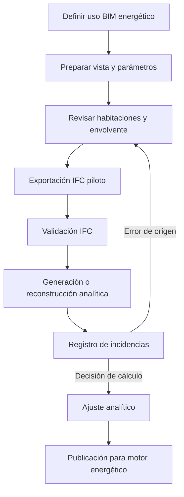

# Estrategia general de modelado en Revit 2026

La preparación para análisis energético no exige crear un segundo edificio independiente dentro de Revit. Exige que el modelo arquitectónico permita obtener, mediante una exportación controlada, una representación geométrica estable y térmicamente interpretable.

La estrategia debe plantearse desde el uso BIM previsto: el modelo se utilizará para generar o reconstruir un modelo analítico destinado a CYPETHERM HE Plus y TeKton3D TK-CEEP, y deberá poder ampliarse hacia otros receptores.

!!! info "Alcance del capítulo"
    Se establecen principios generales de organización y modelado. Los valores, parámetros y configuraciones exactas se desarrollarán en capítulos posteriores y se validarán con Revit 2026.

## 1. Objetivo del modelo preparado

El modelo debe permitir:

1. Identificar todos los volúmenes relevantes.
2. Reconocer la envolvente y sus huecos.
3. Deducir superficies interiores y exteriores.
4. Mantener niveles, orientación y posición.
5. Clasificar elementos de forma reproducible.
6. Generar un IFC ligero y suficiente.
7. Actualizar el modelo sin rehacer todas las correcciones.

No se busca una reproducción exhaustiva del detalle constructivo. Se busca una base fiable para transformar arquitectura en información de cálculo.

## 2. Modelo documental y modelo analizable

### 2.1 Modelo documental

Está optimizado para:

- Planos.
- Detalles.
- Mediciones.
- Visualización.
- Coordinación.
- Construcción.

Puede contener geometría que no aporta información al balance energético o que dificulta su interpretación.

### 2.2 Modelo analizable

Debe priorizar:

- Continuidad de los recintos.
- Claridad de la envolvente.
- Clasificación consistente.
- Huecos realmente vinculados a cerramientos.
- Geometría simplificable.
- Estructura espacial estable.

Un único archivo Revit puede atender ambos objetivos mediante vistas, parámetros, filtros y configuraciones de exportación. Sin embargo, puede ser conveniente utilizar un modelo de coordinación o una copia controlada cuando el modelo contractual no pueda modificarse sin afectar otros usos.

## 3. Principio de fuente única y corrección en origen

Las incidencias que representan errores arquitectónicos deben corregirse en Revit:

- Habitaciones abiertas.
- Elementos duplicados.
- Huecos que no cortan el muro.
- Cubiertas sin continuidad.
- Fases incoherentes.
- Elementos en niveles incorrectos.
- Clasificaciones repetidamente erróneas.

Las decisiones propias del cálculo pueden resolverse en el modelo analítico:

- Agrupación térmica.
- Simplificación de un atrio.
- Obstáculo remoto no perteneciente al modelo arquitectónico.
- Condición equivalente admitida por el motor.

El criterio es evitar que una corrección manual en el receptor oculte un defecto que reaparecerá en la siguiente exportación.

## 4. Preparación temprana

La interoperabilidad debe ensayarse antes de completar el detalle del proyecto. Se recomienda realizar exportaciones piloto en tres momentos:

1. Definición básica de niveles, recintos y envolvente.
2. Incorporación de huecos, cubiertas y soluciones complejas.
3. Cierre previo al cálculo definitivo.

Una prueba temprana permite modificar criterios de modelado cuando el coste todavía es bajo.

## 5. Organización del modelo

### 5.1 Convenciones de nombres

Deben definirse nombres estables para:

- Niveles.
- Habitaciones y espacios.
- Tipos de muros, suelos y cubiertas.
- Puertas y ventanas.
- Vistas de exportación.
- Configuraciones IFC.
- Parámetros energéticos.

El nombre descriptivo puede cambiar; el código de identificación debe mantenerse cuando representa el mismo objeto o tipo.

### 5.2 Códigos de tipos constructivos

La nomenclatura debe ayudar a distinguir función y solución. Un esquema orientativo podría utilizar prefijos como:

| Prefijo | Función |
|---|---|
| `EXT_` | Cerramiento exterior. |
| `INT_` | Partición interior. |
| `MED_` | Medianería. |
| `SOL_` | Solera o contacto con terreno. |
| `CUB_` | Cubierta. |
| `HUE_EXT_` | Hueco exterior. |

Estos prefijos son convenciones del proyecto, no clases IFC. El mapeado debe mantenerse en una matriz separada.

### 5.3 Parámetros compartidos o de proyecto

Los parámetros adicionales deben crearse solo cuando tengan una finalidad definida. Para cada uno se registrará:

- Nombre.
- Tipo de dato.
- Categorías.
- Ejemplar o tipo.
- Valores permitidos.
- Responsable.
- Destino IFC.
- Receptor que lo utiliza.

La proliferación de parámetros sin reglas reduce la calidad en lugar de aumentarla.

## 6. Vista 3D específica de exportación

Se recomienda crear una vista 3D dedicada, por ejemplo:

`00_IFC_ENERGY_EXPORT`

Su función es controlar qué geometría participa en el intercambio. Debe disponer de:

- Disciplina y nivel de detalle definidos.
- Fase y filtro de fase controlados.
- Opciones de diseño verificadas.
- Categorías visibles documentadas.
- Vínculos con posición y visibilidad controladas.
- Caja de sección desactivada en entregas completas o documentada en pruebas parciales.
- Plantilla de vista específica, si resulta compatible con el flujo.

Autodesk permite exportar únicamente los elementos visibles de la vista activa. Cuando esta opción se utiliza en una vista 3D, las habitaciones requieren activar expresamente su exportación y, si existe una caja de sección, solo se incluyen las contenidas en ella.

### 6.1 Riesgo de confiar solo en la visibilidad

La visibilidad de Revit no equivale a participación energética. Un elemento puede estar visible y no ser delimitador; otro puede estar oculto y ser necesario para cerrar el volumen.

Por ello, la vista de exportación debe combinarse con:

- Revisión de habitaciones.
- Clasificación de elementos.
- Control de `Room Bounding`.
- Tablas de planificación.
- Validación del IFC resultante.

## 7. Categorías que normalmente se incluyen

La selección definitiva depende del receptor, pero la base arquitectónica suele incluir:

- Muros.
- Suelos y forjados.
- Cubiertas.
- Techos que delimitan volúmenes relevantes.
- Puertas.
- Ventanas.
- Lucernarios.
- Muros cortina, paneles y elementos necesarios.
- Habitaciones o espacios.
- Elementos de sombra significativos.
- Elementos vinculados que formen parte de la envolvente, mediante la estrategia acordada.

## 8. Categorías que normalmente se excluyen o simplifican

Debe revisarse la necesidad de exportar:

- Mobiliario.
- Sanitarios y equipamiento sin función geométrica para este uso.
- Barandillas decorativas.
- Detalles 2D y anotaciones.
- Vegetación sin efecto de sombra modelado de forma controlada.
- DWG importados.
- Elementos de urbanización lejanos.
- Tornillería, remates y piezas pequeñas.
- Familias de detalle elevado.
- Elementos temporales o auxiliares.

Excluir no significa borrar del modelo. Se controla su participación mediante la vista y la configuración IFC.

## 9. Nivel de detalle geométrico

El detalle debe ser proporcional a su influencia energética. Se conservarán:

- Cambios relevantes de orientación.
- Retranqueos que alteran sombras o superficies.
- Diferencias de construcción.
- Huecos significativos.
- Contactos con terreno.
- Volúmenes que modifican la envolvente.

Podrán simplificarse:

- Molduras.
- Juntas y encuentros constructivos de pequeña escala.
- Rebajes sin influencia apreciable.
- Marcos modelados con geometría excesiva cuando sus propiedades puedan representarse en el hueco.
- Pilares interiores que fragmentan habitaciones sin constituir límites térmicos.

La simplificación debe documentar qué efecto se conserva y cuál se desprecia.

## 10. Elementos delimitadores de habitación

Revit utiliza el parámetro `Room Bounding` para determinar qué elementos intervienen en el cálculo de áreas y volúmenes. Muros, cubiertas, suelos, techos, columnas y líneas separadoras pueden delimitar recintos.

El parámetro debe activarse únicamente cuando el elemento representa un límite real para el volumen analizado.

### 10.1 Riesgo de límites falsos

Autodesk documenta que un elemento parcial marcado como delimitador puede excluir del volumen el espacio situado sobre él. Esto es especialmente relevante en:

- Pilares que no alcanzan el techo.
- Muros de altura parcial.
- Mobiliario o familias auxiliares.
- Revestimientos modelados independientemente.
- Falsos techos.

La revisión de `Room Bounding` debe formar parte del QA/QC, no resolverse categoría por categoría mediante una regla ciega.

## 11. Habitaciones y espacios

El flujo basado en IFC y Open BIM Analytical Model se beneficia de recintos correctamente definidos. Se colocarán habitaciones o espacios en todos los volúmenes relevantes, incluidos:

- Estancias principales.
- Circulaciones interiores.
- Escaleras y atrios según estrategia.
- Patinillos y cámaras cuando influyan.
- Espacios técnicos.
- Áticos y volúmenes bajo cubierta.
- Zonas no habitables relevantes.

Revit tiene desactivado por defecto el cálculo de volúmenes por su impacto en el rendimiento. Para este flujo debe activarse durante la preparación y el control.

La estrategia detallada de habitaciones se desarrollará en un capítulo propio.

## 12. Envolvente térmica

Los elementos deben permitir diferenciar:

- Fachada exterior.
- Partición interior.
- Medianería.
- Muro en contacto con terreno.
- Solera.
- Forjado entre espacios.
- Forjado sobre exterior.
- Cubierta.
- Separación con espacio no habitable.

La categoría de Revit no basta para determinar la condición. Deben considerarse función, posición, tipo, parámetros y relaciones con espacios.

## 13. Huecos

Las puertas, ventanas y lucernarios deben:

- Estar hospedados correctamente.
- Cortar realmente el cerramiento.
- Utilizar categorías apropiadas.
- Diferenciar condición interior/exterior.
- Evitar duplicidades de apertura.
- Tener dimensiones coherentes con la superficie base.

Las puertas acristaladas requieren un criterio específico porque algunos receptores pueden tratarlas como opacas si conservan únicamente la clase de puerta.

## 14. Coordenadas y orientación

El proyecto debe mantener coherentes:

- Punto interno.
- Punto base del proyecto.
- Punto topográfico.
- Coordenadas compartidas, si se utilizan.
- Ubicación geográfica.
- Norte de proyecto.
- Norte verdadero.

La estrategia de exportación elegirá una base de coordenadas explícita. Autodesk permite utilizar origen interno, punto base, punto topográfico, coordenadas compartidas y variantes orientadas al norte verdadero.

Para análisis solar, una orientación incorrecta es más grave que un desplazamiento local. Para sombras remotas y modelos federados, ambos aspectos son relevantes.

## 15. Niveles

Los niveles cumplen funciones gráficas, constructivas y espaciales. No todos deben exportarse como `IfcBuildingStorey`.

Se distinguirán:

- Niveles de planta relevantes.
- Niveles auxiliares de coronación, antepecho o estructura.
- Niveles asociados a edificios vinculados.
- Plantas parciales o cotas partidas.

El parámetro de planta de edificio permitirá controlar qué niveles participan en la estructura espacial. La relación exacta con la exportación IFC se documentará en el capítulo de niveles.

## 16. Fases

Habitaciones y elementos delimitadores deben evaluarse en una fase coherente. Los principales riesgos son:

- Habitación en fase nueva delimitada por elementos de otra fase no visibles.
- Elementos demolidos exportados junto con elementos nuevos.
- Mezcla de existente y proyecto sin una estrategia energética.
- Huecos o cerramientos que cambian entre fases.

La vista de exportación y la configuración IFC deben registrar la fase seleccionada. Autodesk indica que, cuando se exportan únicamente los elementos visibles, se utiliza la fase de la vista.

## 17. Opciones de diseño

No deben exportarse simultáneamente opciones incompatibles que ocupen el mismo espacio. Se definirá:

- Opción principal utilizada para el cálculo.
- Vistas o modelos alternativos para comparar escenarios.
- Convención de nombres y versiones.

Cada alternativa energética debe poder reproducirse sin mezclar geometrías.

## 18. Modelos vinculados

Los vínculos requieren una decisión previa:

1. No exportarlos.
2. Exportarlos como IFC separados.
3. Incorporarlos al mismo proyecto IFC.
4. Utilizarlos únicamente como referencia para comprobación.

La elección depende de quién es responsable de los recintos y de la envolvente. Debe evitarse que un elemento exista a la vez en el anfitrión y en el vínculo.

Autodesk ofrece varias opciones para exportar archivos vinculados. La configuración específica se elegirá tras ensayar la interpretación de cada receptor.

## 19. Subproyectos y modelo central

Los subproyectos afectan a disponibilidad y visibilidad, no deberían utilizarse como único criterio de exportación energética. Antes de publicar se comprobará:

- Elementos prestados o no sincronizados.
- Vínculos descargados.
- Subproyectos cerrados que oculten geometría necesaria.
- Copias locales desactualizadas.

La exportación debe realizarse desde una versión sincronizada y registrada.

## 20. Familias y geometría in situ

Las familias deben utilizar categorías coherentes con su función. Son situaciones de riesgo:

- Familias genéricas utilizadas como cerramientos.
- Geometría in situ compleja.
- Vacíos que no cortan correctamente.
- Familias anidadas que duplican geometría.
- Parámetros IFC contradictorios entre tipo y ejemplar.

Cuando una familia delimita un recinto o contiene un hueco, debe ensayarse expresamente su exportación.

## 21. Modelo nativo de energía de Revit

Revit 2026 puede generar su propio modelo analítico energético a partir de elementos arquitectónicos, masas, habitaciones o espacios. Autodesk indica que el proceso admite pequeños huecos y solapes mediante resoluciones analíticas configurables.

Este manual no utilizará automáticamente el modelo energético nativo de Revit como sustituto del flujo IFC. Sin embargo, puede emplearse como herramienta de diagnóstico:

- Detectar espacios analíticos inesperados.
- Identificar discontinuidades.
- Comparar zonas y superficies.
- Revisar sombras.

Debe mantenerse clara la diferencia entre:

- Modelo energético interno de Revit.
- `IfcSpace` y límites exportados.
- Modelo generado en Open BIM Analytical Model.
- Modelo reconstruido en TeKton3D.

## 22. Estrategia de configuraciones IFC

Se mantendrán configuraciones con nombres y objetivos diferenciados:

| Configuración | Objetivo inicial |
|---|---|
| `IFC_CYPE_ANALYTICAL` | Publicación hacia BIMserver.center y generación analítica. |
| `IFC_TEKTON_IMPORT` | Importación IFC2x3 y conversión a entidades nativas. |
| `IFC_TEKTON_LINK` | Vinculación IFC2x3 o IFC4 como referencia. |

Autodesk permite duplicar configuraciones integradas y guardarlas con el proyecto. Deben evitarse las modificaciones no documentadas de la configuración temporal de sesión.

## 23. Vistas y tablas de control

El modelo preparado incluirá, como mínimo:

- Vista 3D de exportación.
- Secciones de revisión de recintos.
- Vista de habitaciones por planta.
- Tabla de habitaciones.
- Tabla de niveles.
- Tabla de muros.
- Tabla de suelos.
- Tabla de cubiertas.
- Tabla de puertas.
- Tabla de ventanas.
- Tabla de incidencias o parámetros IFC, cuando proceda.

Las tablas deben permitir seleccionar y corregir elementos de forma masiva sin depender únicamente de inspección visual.

## 24. Responsabilidades

| Rol | Responsabilidad |
|---|---|
| BIM Manager | Define requisitos, configuraciones, parámetros y criterios QA/QC. |
| Equipo de arquitectura | Corrige geometría, habitaciones, fases, niveles y familias. |
| Responsable analítico | Valida espacios, superficies, adyacencias y simplificaciones. |
| Especialista energético | Define zonificación, condiciones, sistemas y criterios de cálculo. |

Una incidencia debe asignarse al rol que puede corregir su origen, no necesariamente a quien la detecta.

## 25. Proceso recomendado

## 26. Criterios generales de aceptación

El modelo Revit podrá pasar a configuración detallada de exportación cuando:

- [ ] Existe una vista 3D específica y documentada.
- [ ] La fase y la opción de diseño están definidas.
- [ ] Los niveles relevantes están identificados.
- [ ] La ubicación y el norte están verificados.
- [ ] Los recintos relevantes tienen área y volumen.
- [ ] `Room Bounding` se ha revisado en elementos de riesgo.
- [ ] La envolvente puede clasificarse.
- [ ] Los huecos están correctamente hospedados.
- [ ] No existen duplicados críticos.
- [ ] Los vínculos tienen una estrategia definida.
- [ ] Se ha realizado al menos una exportación piloto.
- [ ] Las incidencias encontradas tienen responsable y estado.

## 27. Decisiones pendientes de ensayo

Los siguientes puntos no se cerrarán sin pruebas en Revit 2026:

1. Versión exacta del exportador IFC.
2. Comportamiento de habitaciones en vistas 3D.
3. Diferencias entre volumen calculado y extrusión 2D de límites.
4. Límites espaciales de primer y segundo nivel.
5. Mapeado de `IsExternal`.
6. `ZoneName` y agrupaciones.
7. Puertas acristaladas.
8. Revestimientos modelados por separado.
9. Falsos techos y plénums.
10. Vínculos y coordenadas.
11. GUID tras reexportación.

## 28. Fuentes principales

- Autodesk, *Export a Model to IFC*, Revit 2026.
- Autodesk, *Customize the IFC Setup*, Revit 2026.
- Autodesk, *How Room Volume is Computed*, Revit 2026.
- Autodesk, *Situations That Can Affect Room Volume Computations*, Revit 2026.
- Autodesk, *About Creating Energy Analytical Models from Architectural Elements*, Revit 2026.
- CYPE, *Guía de interoperabilidad CYPE-Revit v2.0* (`CYPE-REVIT-20`).
- Documentación propia de preparación de Revit para programas térmicos de CYPE.
