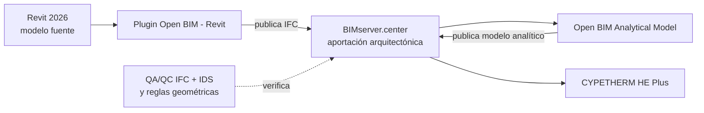

# BIMserver.center y Plugin Open BIM - Revit

Este capítulo establece el primer tramo del flujo entre Revit 2026, BIMserver.center y Open BIM Analytical Model. Su objetivo no es describir todas las funciones colaborativas del plugin, sino asegurar que la aportación arquitectónica utilizada para generar el modelo analítico sea identificable, reproducible y validable.

!!! warning "Publicar no equivale a validar"
    Que el modelo aparezca correctamente en BIMserver.center no demuestra que sus espacios, límites, propiedades o coordenadas sean adecuados para el análisis energético. El IFC exacto de la aportación debe superar el procedimiento QA/QC de esta guía.

## 1. Función de cada componente

| Componente | Función en este flujo | No debe utilizarse como |
|---|---|---|
| Revit | Fuente del modelo arquitectónico y de los recintos | Modelo energético final |
| Plugin Open BIM - Revit | Vinculación, publicación IFC y consulta de actualizaciones | Validador geométrico o energético |
| BIMserver.center | Contenedor del proyecto y de sus aportaciones versionadas | Sustituto del archivo fuente o del registro QA/QC |
| Open BIM Analytical Model | Generación y edición del modelo geométrico analítico | Copia literal e incuestionable del IFC |
| CYPETHERM HE Plus | Definición y cálculo del modelo energético reglamentario | Herramienta de reparación del modelo arquitectónico |

El intercambio se realiza mediante archivos y aportaciones. Aunque la documentación comercial emplee expresiones como colaboración bidireccional o en tiempo real, para efectos de trazabilidad se considerará un proceso de **publicación, consulta y actualización de versiones**, no una base de datos única modificada simultáneamente por todas las aplicaciones.

## 2. Compatibilidad e instalación

La documentación oficial consultada el 13 de julio de 2026 indica:

- La parte común del plugin es compatible con Revit 2016–2027.
- Las funciones relacionadas con generación de elementos nativos son compatibles con Revit 2022–2027.
- Revit LT no permite instalar complementos.
- El plugin puede instalarse desde CYPE Menu o desde la Store de BIMserver.center.
- Para actualizarlo debe cerrarse Revit antes de ejecutar la instalación.

Nuestro flujo utiliza Revit 2026 o posterior, pero cada ensayo debe registrar:

- Versión completa de Revit.
- Compilación o *build* de Revit.
- Versión del exportador IFC de Autodesk.
- Versión del Plugin Open BIM - Revit.
- Fecha de instalación o actualización.
- Usuario y ámbito de instalación.

No se dará por compatible una versión futura únicamente porque el instalador la reconozca. Debe repetirse el modelo de ensayo cuando cambie Revit, el exportador o el plugin.

## 3. Requisitos previos

Antes de vincular o publicar:

1. El modelo Revit debe superar el checklist previo a exportación.
2. La vista y la fase de exportación deben estar aprobadas.
3. Habitaciones o espacios deben tener área y volumen válidos.
4. Los pilares interiores no deben delimitar los recintos energéticos.
5. No deben existir habitaciones o espacios solapados.
6. Coordenadas, Norte verdadero y niveles deben estar documentados.
7. Debe conocerse quién es responsable de la aportación arquitectónica.
8. El proyecto de BIMserver.center de destino debe estar identificado inequívocamente.

No se publicará una prueba en el proyecto productivo sin distinguirla en el nombre, descripción y registro de incidencias.

## 4. Organización del proyecto en BIMserver.center

El proyecto debe disponer, como mínimo, de responsables para:

- Administración del proyecto.
- Publicación del modelo arquitectónico.
- Revisión del IFC.
- Generación del modelo analítico.
- Revisión energética.
- Aprobación de actualizaciones.

Cada aportación relevante debe registrar:

| Dato | Ejemplo |
|---|---|
| Código de proyecto | `PRJ-ENERGIA-001` |
| Disciplina | Arquitectura |
| Aplicación de origen | Revit 2026 |
| Autor de la aportación | Responsable designado |
| Estado | Prueba, candidato o aprobado |
| Revisión | `R01` |
| Fecha | Fecha ISO 8601 |
| Configuración IFC | Perfil y versión |
| Hash del IFC | SHA-256 |

El nombre visible de la aportación no sustituye al hash ni al registro de la configuración.

## 5. Vinculación desde Revit

La herramienta **Vincular a proyecto Open BIM** permite seleccionar el proyecto de BIMserver.center y las aportaciones que se incorporarán como referencia.

Procedimiento controlado:

1. Iniciar sesión con la cuenta autorizada.
2. Abrir el RVT correcto y comprobar su revisión.
3. Seleccionar el proyecto de BIMserver.center por código y nombre.
4. Revisar participantes y aportaciones existentes.
5. Seleccionar únicamente los modelos necesarios para coordinación.
6. Comprobar la posición de los vínculos recibidos.
7. Guardar y registrar la vinculación.

Antes de aceptar debe verificarse que no se está conectando el RVT de producción a un proyecto de pruebas o a una duplicación del proyecto con nombre parecido.

## 6. Opciones IFC del plugin

La herramienta **Opciones IFC** complementa la configuración accesible desde `Archivo > Exportar > IFC > Modificar configuración` en Revit. CYPE indica expresamente que puede sobrescribir opciones de importación y exportación.

El plugin permite seleccionar, entre otras posibilidades:

- Configuración `Revit`, que utiliza el fichero de configuración de Revit.
- Configuración `Open BIM`, con un mapeado propuesto para las herramientas de CYPE.
- Modificación de clases IFC asociadas a categorías Revit.
- Opciones de importación y posicionamiento de vínculos IFC.

### 6.1 Regla de esta guía

No se asumirá que el IFC generado mediante **Compartir el modelo de Revit** coincide con un IFC obtenido manualmente usando un perfil de Revit del mismo nombre.

Se registrará:

- Modo seleccionado: `Revit` u `Open BIM`.
- Archivo o configuración de origen.
- Sobrescrituras realizadas por el plugin.
- Clases IFC modificadas.
- Esquema IFC resultante.
- Vista, fase y coordenadas utilizadas.

### 6.2 Perfiles candidatos

Se ensayarán al menos dos publicaciones del modelo de referencia:

1. **Perfil Revit controlado:** reutiliza la configuración energética aprobada en Revit.
2. **Perfil Open BIM:** emplea el mapeado propuesto por CYPE.

La elección final se realizará por evidencia. Se compararán espacios, límites, cerramientos, huecos, coordenadas, propiedades y resultado en Open BIM Analytical Model.

## 7. Compartir el modelo de Revit

La opción **Compartir el modelo de Revit** genera un IFC y lo incorpora al proyecto vinculado.

Procedimiento:

1. Sincronizar el modelo central y comprobar que no existen cambios pendientes.
2. Abrir la vista de exportación energética aprobada.
3. Confirmar fase, opción de diseño y vínculos visibles.
4. Confirmar las Opciones IFC del plugin.
5. Introducir una descripción que identifique objetivo, revisión y perfil.
6. Generar y publicar la aportación.
7. Registrar fecha, usuario y versión de software.
8. Obtener el IFC exacto asociado a la aportación.
9. Calcular su hash SHA-256.
10. Ejecutar la prevalidación IFC, el perfil IDS energético y las reglas geométricas.

Si el IFC validado no es exactamente el publicado, el control carece de trazabilidad.

## 8. Control del IFC publicado

El archivo de la aportación debe comprobarse independientemente de Revit y del visor de la plataforma.

Controles mínimos:

- El archivo abre y cumple el esquema declarado.
- El encabezado identifica aplicación y versión.
- Existe una estructura espacial coherente.
- Edificio y plantas tienen nombres válidos.
- Existen los `IfcSpace` previstos.
- Los espacios tienen geometría cerrada, área y volumen.
- No existen intersecciones entre espacios superiores a la tolerancia.
- Los pilares no participan como límites espaciales.
- Cerramientos y huecos están correctamente clasificados.
- Coordenadas y orientación coinciden con el modelo fuente.
- El hash coincide con el registro de la aportación.

El informe consolidado de nuestra herramienta QA/QC se conservará con la revisión del modelo.

## 9. Importación de aportaciones en Revit

El plugin puede incorporar vínculos IFC, extraerlos como `DirectShape` o, con módulos y categorías compatibles, convertir determinados contenidos en elementos nativos mediante asignación de familias.

Estas funciones no son necesarias para transferir el modelo arquitectónico hacia Open BIM Analytical Model. En este flujo:

- Los IFC recibidos se usarán preferentemente como referencia de coordinación.
- No se convertirán a elementos nativos sin un objetivo independiente y documentado.
- No se duplicará en Revit un elemento ya existente en el modelo fuente.
- No se utilizará un `DirectShape` importado para reparar la envolvente energética.

La conversión de elementos nativos constituye otro flujo y requiere sus propias pruebas de identidad, categorías, parámetros y actualización.

## 10. IFC original e IFC local

La documentación de aprendizaje del plugin distingue entre ficheros IFC originales y locales asociados a los vínculos. Esta diferencia debe considerarse al investigar una incidencia:

- El **original** representa la aportación recibida.
- El **local** puede incorporar el tratamiento necesario para su uso dentro del entorno Revit.

No se compararán hashes ni geometrías sin identificar cuál de los dos archivos se está revisando. Para validar la aportación publicada se utilizará el archivo original correspondiente a esa versión; el archivo local se revisará cuando el problema afecte a su representación o posicionamiento en Revit.

Esta interpretación deberá confirmarse visualmente en el ensayo con la versión instalada del plugin.

## 11. Coordenadas y orientación

La importación y publicación deben respetar el protocolo de coordenadas de la guía.

Se comprobarán:

- Origen interno de Revit.
- Punto base del proyecto.
- Punto topográfico y coordenadas compartidas.
- Base de exportación IFC.
- Rotación entre Proyecto Norte y Norte verdadero.
- Elevación de plantas.
- Posición de los vínculos recibidos.

El panel del plugin puede ofrecer herramientas para ajustar vínculos a puntos de referencia. Cualquier desplazamiento debe registrarse. No se corregirá manualmente un vínculo para que “parezca coincidir” sin determinar antes qué sistema de coordenadas utiliza.

## 12. Consulta y actualización del proyecto

**Consultar estado del proyecto** permite detectar cambios en las aportaciones y decidir qué vínculos se actualizan. La actualización no debe aceptarse de forma automática en una revisión energética aprobada.

Ciclo recomendado:

1. Consultar cambios disponibles.
2. Identificar autor, aplicación y revisión de cada aportación.
3. Descargar o actualizar en una copia de trabajo.
4. Revisar posición y contenido.
5. Regenerar el modelo analítico cuando el cambio afecte a geometría o recintos.
6. Comparar espacios, superficies y colindancias antes y después.
7. Aceptar la nueva revisión o volver a la anterior.
8. Registrar las incidencias resueltas y pendientes.

Una actualización arquitectónica puede invalidar correcciones manuales realizadas en Open BIM Analytical Model. La estrategia de regeneración se desarrollará en el capítulo siguiente.

## 13. Cancelación de la colaboración

La opción **Cancelar colaboración en proyecto Open BIM** desactiva los mensajes de colaboración y puede eliminar vínculos IFC.

Antes de utilizarla:

- Confirmar que se está trabajando sobre el RVT correcto.
- Registrar el motivo.
- Conservar los IFC e informes necesarios para reproducir la revisión.
- Decidir conscientemente si deben eliminarse los vínculos.
- Comprobar que no se pierde una referencia utilizada en documentación o coordinación.

No se utilizará como método rutinario para corregir una vinculación mal configurada.

## 14. Estados del flujo

| Estado | Condición |
|---|---|
| `RVT_PREPARADO` | Modelo fuente revisado antes de compartir |
| `IFC_PUBLICADO` | Aportación disponible, aún no validada |
| `IFC_CANDIDATO` | IFC descargado, identificado y sometido a QA/QC |
| `IFC_APROBADO` | Cumple los requisitos para generar el analítico |
| `ANALITICO_GENERADO` | Open BIM Analytical Model ha generado un resultado |
| `ANALITICO_APROBADO` | Espacios, superficies, aristas y sombras revisados |

El cambio de estado debe quedar asociado a un responsable y a evidencias.

## 15. Errores frecuentes

| Síntoma | Causa probable | Acción inicial |
|---|---|---|
| El proyecto correcto no aparece | Cuenta o permisos incorrectos | Revisar usuario y participantes |
| Se publica un IFC distinto del ensayo manual | Opciones IFC del plugin sobrescriben Revit | Comparar configuraciones y entidades |
| Faltan espacios | Vista, fase o exportación de recintos incorrecta | Revisar vista y opciones IFC |
| El edificio aparece girado | Base o Norte verdadero incoherentes | Comparar orientación conocida |
| El modelo aparece desplazado | Sistemas de coordenadas diferentes | Revisar origen y punto de inserción |
| Aparecen elementos duplicados | Anfitrión y vínculo contienen lo mismo | Definir autoría y retirar duplicado |
| Una actualización rompe el analítico | Cambio de geometría o identificadores | Comparar revisiones y regenerar controladamente |
| El visor parece correcto, pero el analítico falla | IFC insuficiente o geometría no calculable | Ejecutar QA/QC y revisar espacios |

## 16. Ensayo obligatorio de referencia

El ensayo se realizará con el modelo mínimo de interoperabilidad y una copia controlada de un modelo real.

Se publicarán dos aportaciones, una con perfil `Revit` y otra con perfil `Open BIM`. Para cada una se registrarán:

- Número de espacios en Revit e IFC.
- Áreas y volúmenes.
- Número de límites espaciales.
- Entidades de cerramiento y huecos.
- Cobertura de propiedades energéticas.
- Coordenadas y Norte verdadero.
- Resultado del perfil IDS energético.
- Resultado de `EEM-SPA-001` y `EEM-GEO-001`.
- Capacidad de generación en Open BIM Analytical Model.
- Número y tipo de correcciones manuales requeridas.

Se aprobará el perfil que produzca el modelo analítico más fiable y reproducible, no necesariamente el IFC con mayor cantidad de información.

## 17. Checklist de publicación

- [ ] Revit, exportador y plugin están identificados.
- [ ] El proyecto de BIMserver.center es el correcto.
- [ ] La aportación tiene autor y descripción.
- [ ] Vista, fase, opción y vínculos están controlados.
- [ ] Las Opciones IFC del plugin están registradas.
- [ ] Coordenadas y Norte verdadero están verificados.
- [ ] El IFC exacto publicado se ha recuperado.
- [ ] Se ha calculado y registrado su hash.
- [ ] El IFC supera esquema, IDS y reglas QA/QC.
- [ ] El informe de validación se conserva con la revisión.
- [ ] La aportación está autorizada para generar el modelo analítico.

## 18. Fuentes

- CYPE, [Plugin Open BIM - Revit](https://info.cype.com/es/software/plugin-open-bim-revit/), consulta del 13 de julio de 2026.
- CYPE, [Opciones IFC del Plugin Open BIM - Revit](https://info.cype.com/es/tema/plugin-open-bim-revit-opciones-ifc/), consulta del 13 de julio de 2026.
- CYPE Learning, [curso del Plugin Open BIM - Revit](https://learning.cype.com/es/video/plugin-open-bim-revit-interfaz-y-acceso-en-revit/), publicado entre diciembre de 2025 y enero de 2026.
- CYPE, *Open BIM Analytical Model. Manual de uso*, archivo `ob_analytical_01.pdf` facilitado para esta guía.

