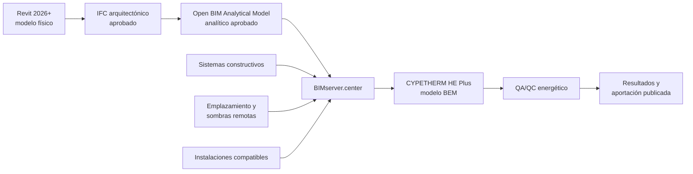

# CYPETHERM HE Plus

CYPETHERM HE Plus convierte la geometría analítica aprobada y el resto de datos energéticos en el modelo BEM que utiliza para simular el edificio con EnergyPlus y efectuar las comprobaciones reglamentarias que correspondan. Este capítulo establece cómo crear, completar, calcular, actualizar y auditar ese modelo sin perder la relación con Revit, el IFC y Open BIM Analytical Model.

!!! warning "Importar no equivale a calcular correctamente"
    La importación puede finalizar sin errores y contener una orientación, colindancia, construcción, zona, perfil de uso o sistema incorrectos. La obra solo alcanzará el estado `BEM_APROBADO` después de revisar las entradas, calcular, analizar los avisos y superar los controles de coherencia y sensibilidad.

## 1. Alcance reglamentario y versión

La documentación oficial vigente consultada el 13 de julio de 2026 describe CYPETHERM HE Plus como herramienta para:

- Certificación de la eficiencia energética de edificios.
- Justificación del CTE DB HE1.
- Justificación del CTE DB HE0.
- Justificación del CTE DB HE4.
- Simulación energética sin justificación normativa.

La intervención, el uso, el tamaño y las demás condiciones del edificio determinan qué comprobaciones son aplicables. No se seleccionará un modo únicamente porque el programa lo permita: el alcance reglamentario debe quedar fijado por el responsable del proyecto.

La página oficial indica actualmente EnergyPlus 23.1 como versión integrada. Este dato no se tratará como permanente. En cada entrega se registrarán:

| Dato | Registro obligatorio |
|---|---|
| CYPETHERM HE Plus | Versión completa y procedencia de la instalación |
| EnergyPlus | Versión integrada mostrada o documentada para esa edición |
| CteEPBD | Versión o identificación disponible |
| Marco normativo | Edición y modificaciones aplicables del CTE y del procedimiento de certificación |
| Obra | Tipo de intervención, uso y alcance de cálculo |
| Fecha | Fecha de creación y último cálculo aprobado |

Para certificación energética se comprobará además que la edición empleada tenga la condición oficial requerida en la fecha de presentación. La validez para justificar el CTE y la validez administrativa para emitir el certificado no deben confundirse.

## 2. Posición en el flujo aprobado

El flujo principal de esta guía es:

`Revit 2026+ → Plugin Open BIM - Revit → BIMserver.center → Open BIM Analytical Model → BIMserver.center → CYPETHERM HE Plus`.

CYPETHERM también permite modelar directamente o importar un IFC mediante su editor 3D. Estas rutas se consideran alternativas o recursos de diagnóstico. No sustituyen al flujo aprobado sin un ensayo comparativo y una decisión documentada.

## 3. Capas de información

No toda la información procede del mismo archivo ni tiene la misma autoridad.

| Capa | Fuente preferente | Contenido esperado |
|---|---|---|
| Geometría física | Revit/IFC arquitectónico | Elementos, huecos, espacios y referencias de origen |
| Geometría analítica | Open BIM Analytical Model | Zonas geométricas, recintos, superficies, huecos, colindancias y sombras propias |
| Soluciones constructivas | Biblioteca controlada o CYPE Construction Systems | Capas, propiedades térmicas e identificación de soluciones |
| Emplazamiento | Fuente oficial del proyecto y aplicaciones compatibles | Localización, clima, orientación y datos del terreno |
| Sombras remotas | Open BIM Site u origen controlado | Obstáculos exteriores relevantes |
| Condiciones operacionales | Responsable energético | Usos, perfiles, consignas, ventilación, ocupación, iluminación y cargas |
| Instalaciones | Responsable de instalaciones o aplicaciones compatibles | Climatización, ventilación, ACS y contribuciones renovables |
| Marco reglamentario | Responsable del cálculo | Tipo de intervención, alcance, opciones y documentos aplicables |

La existencia de una propiedad térmica en Revit o en el IFC no demuestra que CYPETHERM la haya importado ni que la utilice. Las construcciones efectivamente asignadas en la pestaña **Edificio** constituyen la entrada del modelo BEM.

## 4. Requisitos de entrada

La obra nueva solo se vinculará a un modelo con estado `ANALITICO_APROBADO`. Antes de importarlo deben estar disponibles:

- Proyecto correcto de BIMserver.center.
- Identificador y revisión de la aportación analítica.
- Identificador y hash del IFC arquitectónico de origen.
- Informe QA/QC del IFC y del modelo analítico.
- Recuentos y magnitudes aprobadas.
- Relación de correcciones manuales del analítico.
- Versiones de todas las aplicaciones utilizadas.
- Aportaciones complementarias autorizadas.

Se conservará una captura o acta del panel de importación que identifique qué modelos se incorporaron. El nombre visible del proyecto no basta para acreditar la entrada.

## 5. Creación controlada de la obra

Para una justificación o certificación ordinaria:

1. Crear una obra nueva.
2. Seleccionar **Verificación normativa**.
3. Vincularla al proyecto correcto de BIMserver.center.
4. Seleccionar como iniciador el modelo analítico aprobado.
5. Elegir expresamente las aportaciones complementarias.
6. Registrar las opciones ofrecidas por el asistente.
7. Finalizar la importación y guardar una primera revisión sin corregir.
8. Comparar el resultado con el acta del modelo analítico.

La opción **Certificación energética con medidas de mejora** corresponde a otro entorno y a otro objetivo. Se documentará en una ampliación posterior de la guía.

## 6. Qué puede importarse y qué debe verificarse

Desde el modelo analítico pueden incorporarse zonas, recintos, elementos opacos, huecos y sombras propias. Otras aportaciones pueden proporcionar soluciones constructivas, emplazamiento, sombras remotas, iluminación o determinados sistemas.

Después de importar se comprobará, como mínimo:

| Información | Comprobación en CYPETHERM |
|---|---|
| Zonas y recintos | Número, referencia, uso, área, volumen y pertenencia |
| Elementos opacos | Tipo, condición de contorno, área, orientación y construcción |
| Huecos | Anfitrión, dimensiones, área, orientación, vidrio, marco y sombra |
| Colindancias | Espacio a cada lado y ausencia de falsos exteriores |
| Sombras propias | Posición, forma y efecto esperado |
| Sombras remotas | Origen, posición y ausencia de duplicados |
| Construcciones | Correspondencia entre referencia importada y solución calculada |
| Emplazamiento | Localidad, zona climática, altitud y datos requeridos |
| Norte | Azimut conocido sin rotación duplicada |
| Sistemas | Servicio, zona atendida, prestaciones y vector energético |

Los valores ausentes o no reconocidos se completarán en CYPETHERM, pero se registrará cuál es su fuente documental.

## 7. Comparación geométrica de recepción

Antes de asignar datos energéticos se comparará CYPETHERM con el modelo analítico aprobado.

| Métrica | Analítico aprobado | CYPETHERM | Diferencia | Estado |
|---|---:|---:|---:|---|
| Zonas geométricas |  |  |  |  |
| Recintos |  |  |  |  |
| Área útil |  |  |  |  |
| Volumen |  |  |  |  |
| Superficies exteriores |  |  |  |  |
| Superficies a terreno |  |  |  |  |
| Particiones interiores |  |  |  |  |
| Medianerías |  |  |  |  |
| Huecos |  |  |  |  |
| Área acristalada por orientación |  |  |  |  |
| Sombras propias/remotas |  |  |  |  |

Los totales se desglosarán por planta, recinto, orientación y tipo cuando exista una diferencia. Una compensación entre un elemento omitido y otro duplicado puede producir un total aparentemente correcto.

## 8. Revisión del modelo 3D y del árbol Edificio

El visor del bloque **Modelo 3D** representa el BEM creado a partir de las definiciones de la pestaña **Edificio**. Se recorrerá el árbol completo, seleccionando cada zona y los casos de riesgo.

Controles visuales:

- Volumen y planta del edificio.
- Orientación de fachadas conocidas.
- Recintos ausentes, duplicados o fusionados.
- Superficies muy pequeñas o alejadas.
- Cerramientos clasificados como exteriores sin serlo.
- Contactos con terreno y medianerías.
- Huecos ausentes o fuera de su anfitrión.
- Dobles alturas, escaleras, atrios y plénums.
- Sombras propias y remotas.

Si faltan huecos, se investigarán primero solapes entre elementos físicos, caras de recintos no coincidentes, hospedaje y geometría de origen. La FAQ de CYPE advierte que estas incoherencias pueden impedir su generación. La solución preferente es corregir el origen y volver a publicar.

## 9. Datos generales y emplazamiento

Se revisarán antes de las bibliotecas y zonas:

- Tipo de intervención.
- Uso principal y unidades de uso.
- Alcance HE0, HE1, HE4 y certificación.
- Localidad y datos climáticos.
- Altitud y emplazamiento.
- Orientación.
- Condiciones del terreno cuando procedan.
- Opciones de condensaciones y permeabilidad.

La orientación debe provenir de una única transformación controlada. Si Revit, IFC y el analítico ya transmiten correctamente el Norte verdadero, no se aplicará una segunda rotación en CYPETHERM. Se verificará mediante el azimut de una fachada conocida y no solo por la apariencia del visor.

## 10. Bibliotecas de recintos

La geometría del recinto no define por sí sola su comportamiento. La biblioteca debe establecer, según el uso y el alcance aplicables:

- Condición habitable o no habitable.
- Perfil de uso.
- Ocupación y cargas internas.
- Iluminación.
- Consignas y periodos de funcionamiento.
- Ventilación e infiltración.
- Demanda de ACS cuando corresponda.

No se copiará un perfil entre recintos porque tengan el mismo nombre arquitectónico. Se comprobará que su comportamiento real y reglamentario sea equivalente.

## 11. Zonificación térmica

Un recinto geométrico, un espacio de Revit y una zona térmica no son necesariamente la misma unidad. La agrupación térmica debe responder a condiciones homogéneas de uso, operación y sistemas.

Se separarán zonas cuando existan diferencias relevantes de:

- Uso o horario.
- Consigna.
- Orientación y ganancias solares.
- Sistema o control.
- Condición habitable/no habitable.
- Ventilación o cargas internas.

Se documentará una tabla de correspondencia:

| Código Revit/IFC | Recinto analítico | Recinto CYPETHERM | Zona térmica | Perfil | Sistema |
|---|---|---|---|---|---|
|  |  |  |  |  |  |

La simplificación de zonas se justificará por su impacto, no solo por reducir el tiempo de cálculo.

## 12. Soluciones constructivas opacas

Cada referencia geométrica debe quedar asociada a una solución constructiva calculable. Para cada solución se registrarán:

- Código estable.
- Descripción y procedencia.
- Capas, espesores y materiales.
- Conductividad, densidad, calor específico y resistencia cuando sean aplicables.
- Resistencia y transmitancia resultantes.
- Condición exterior, interior, terreno o medianería.
- Evidencia de producto o hipótesis de proyecto.
- Revisión de la biblioteca.

Varios tipos de Revit pueden compartir una construcción energética si son térmicamente equivalentes. A la inversa, un único tipo físico no debe ocultar tramos con soluciones o condiciones de contorno distintas.

No se introducirá manualmente una U que contradiga las capas sin documentar el método y la autoridad del valor. Se comprobará qué magnitud utiliza efectivamente el programa.

## 13. Huecos y elementos transparentes

Por cada tipología se revisarán:

- Dimensiones y área de hueco.
- Fracción de marco y área acristalada.
- Transmitancia del vidrio y del marco.
- Factor solar y propiedades ópticas.
- Permeabilidad al aire.
- Dispositivo de sombra fijo o móvil.
- Orientación e inclinación.
- Anfitrión y recinto.

Los muros cortina se descompondrán de forma coherente en paneles transparentes, opacos y marcos. No se aprobará una fachada completa como un único vidrio si no representa la solución real.

## 14. Aristas y puentes térmicos

El procesamiento de aristas se realizará después de aprobar la geometría y las construcciones. La documentación de CYPE indica que los elementos importados deben conservar su referencia o nombre para poder utilizar este procesamiento en las actualizaciones.

Se comprobará:

- Encuentros generados y longitud.
- Tipo de unión.
- Valor de transmitancia térmica lineal y procedencia.
- Elementos y zonas afectados.
- Encuentros omitidos o duplicados.
- Coherencia con UNE-EN ISO 14683, UNE-EN ISO 10211 o DA DB-HE/3, según el método empleado.

Una geometría fragmentada puede multiplicar aristas y alterar pérdidas. No se compensará automáticamente con una simplificación sin analizar el origen.

## 15. Sombras propias y remotas

Las sombras propias pueden llegar con el modelo analítico. Las remotas pueden incorporarse desde Open BIM Site después de que el modelo analítico esté disponible en el proyecto.

Se verificará:

- Que no exista el mismo obstáculo en dos aportaciones.
- Posición y altura respecto al edificio.
- Silueta relevante y orientación.
- Ausencia de detalle innecesario.
- Clasificación como sombra, no como cerramiento.
- Efecto razonable sobre los huecos afectados.

Se realizará un ensayo de sensibilidad retirando temporalmente una sombra significativa. El cambio debe aparecer en ganancias solares, demanda o el indicador relacionado con el control solar, con un signo físicamente razonable.

## 16. Sistemas, ACS y energías renovables

Cuando el alcance incluya HE0, HE4 o certificación, se revisarán los servicios y sistemas necesarios:

- Zonas atendidas.
- Calefacción y refrigeración.
- Ventilación cuando forme parte de la definición.
- Producción y distribución de ACS.
- Generadores, emisores y unidades terminales.
- Rendimientos y prestaciones a carga parcial.
- Vectores energéticos.
- Contribuciones renovables.
- Equipos auxiliares y sistemas de sustitución.

La importación desde una aplicación compatible no exime de verificar la correspondencia con el proyecto. Se confirmará que cada zona esté atendida como se pretende y que no existan sistemas duplicados, sin uso o de sustitución introducidos de forma involuntaria.

## 17. Opciones de cálculo

El modo se elegirá según el alcance aprobado:

- Control de la demanda energética HE1.
- HE1, HE0, HE4 y calificación.
- Calificación energética.
- Simulación energética sin justificación normativa.

Las opciones adicionales también forman parte de la entrada y deben registrarse, especialmente:

- Comprobación o cálculo de demanda.
- Equipos suplementarios.
- Simplificación de particiones verticales u horizontales.
- Periodo de simulación.

Para documentación reglamentaria se utilizará la simulación anual requerida. Un periodo reducido puede servir para diagnóstico, pero no genera por sí mismo los documentos justificativos que exigen cálculo anual.

Activar equipos suplementarios puede ocultar horas fuera de consigna causadas por un sistema insuficiente o mal asignado. Su uso debe corresponder al objetivo del cálculo.

## 18. Secuencia de cálculo controlado

1. Guardar una revisión previa al cálculo.
2. Confirmar el modo y las opciones.
3. Revisar incidencias del árbol **Edificio**.
4. Ejecutar el cálculo.
5. Registrar si el proceso finaliza o se interrumpe.
6. Revisar todos los avisos y errores de EnergyPlus.
7. Revisar resultados por edificio, zona y mes.
8. Generar los listados aplicables.
9. Ejecutar controles de coherencia y sensibilidad.
10. Aprobar, corregir o rechazar la revisión.

Al cambiar datos entre pestañas se regenerarán los listados mediante **Calcular**. No se entregará un listado anterior a la última modificación.

## 19. Revisión de los ficheros de cálculo

CYPETHERM permite consultar los ficheros de entrada, avisos y resultados de EnergyPlus, además de la entrada a CteEPBD. Se conservarán como evidencia cuando la incidencia o el alcance lo justifiquen.

| Evidencia | Contenido | Uso QA/QC |
|---|---|---|
| `Project_dem.idf` | Entrada de demanda | Confirmar zonas, superficies y parámetros enviados |
| `Project_cons.idf` | Entrada de consumo | Investigar sistemas y consumos |
| `Project_solar.idf` | Entrada de control solar | Revisar huecos y sombras |
| `Project_dem.err` | Avisos de demanda | Clasificar advertencias del motor |
| `Project_cons.err` | Avisos de consumo | Detectar problemas de sistemas |
| `Project_solar.err` | Avisos de cálculo solar | Detectar errores geométricos o solares |
| `Project_*Table.html` | Resultados del motor | Diagnóstico detallado |
| Fichero CteEPBD | Entrada de indicadores | Trazar energía final, vectores y servicios |

No se editarán estos ficheros para producir el resultado oficial. Se utilizan para inspección y diagnóstico de la obra generada por CYPETHERM.

## 20. Coherencia de resultados

La revisión no se limitará al indicador de cumplimiento. Se analizarán:

- Demanda de calefacción y refrigeración por zona.
- Balance de ganancias y pérdidas.
- Consumos por servicio y vector energético.
- Rendimientos estacionales.
- Energía primaria total y no renovable.
- Emisiones de CO₂.
- Horas fuera de consigna.
- Resultados de control solar.
- ACS y contribución renovable cuando proceda.
- Distribución mensual y casos extremos.

Se investigarán valores nulos, cambios bruscos entre zonas equivalentes, demandas con signo o distribución inesperados y mejoras que empeoren el resultado sin una explicación física.

## 21. Ensayos mínimos de sensibilidad

Sobre una copia de la obra se realizarán, al menos, tres comprobaciones:

1. **Envolvente:** modificar de forma clara la transmitancia de una solución repetida.
2. **Solar:** retirar una sombra relevante o modificar el factor solar de un hueco representativo.
3. **Operación o sistema:** cambiar una consigna, perfil o prestación con impacto conocido.

El resultado debe cambiar en el sentido esperado y afectar a las zonas correspondientes. Se restaurará la obra base después de cada ensayo. La ausencia de respuesta obliga a comprobar si el parámetro está realmente asignado o utilizado.

## 22. Actualización desde BIMserver.center

La opción **Actualizar** permite sincronizar cambios de las aportaciones seleccionadas. No se utilizará directamente sobre la única copia aprobada.

### 22.1 Antes de actualizar

1. Guardar una copia o utilizar la opción de copia de seguridad de la obra.
2. Registrar la revisión actual y sus resultados principales.
3. Identificar qué aportación cambió.
4. Obtener una relación de elementos añadidos, modificados y eliminados.
5. Inventariar asignaciones y correcciones realizadas en CYPETHERM.
6. Definir el alcance de la nueva revisión.

### 22.2 Después de actualizar

1. Comprobar el panel de importación y los mensajes.
2. Comparar recintos, superficies, huecos y sombras.
3. Verificar que las referencias conservadas mantienen sus asignaciones.
4. Revisar construcciones, zonas, aristas y sistemas.
5. Recalcular y comparar indicadores.
6. Documentar asignaciones perdidas o regeneradas.
7. Aprobar o restaurar la revisión anterior.

CYPE recomienda realizar los cambios en las aplicaciones de origen. Las correcciones menores específicas del cálculo pueden introducirse numéricamente en **Edificio**, pero deben quedar documentadas y comprobarse tras cada actualización.

## 23. Decisión sobre dónde corregir

| Incidencia | Lugar preferente de corrección |
|---|---|
| Recinto ausente, solapado o abierto | Revit y nueva publicación IFC |
| Superficie o colindancia incorrecta | Revit o Open BIM Analytical Model, según la causa |
| Hueco ausente por geometría/hospedaje | Revit |
| Sombra analítica simplificada | Open BIM Analytical Model/Open BIM Site |
| Construcción no asignada | Biblioteca o CYPE Construction Systems/CYPETHERM |
| Perfil de uso o consigna | CYPETHERM |
| Sistema mal definido en su fuente | Aplicación de instalaciones o CYPETHERM según autoría |
| Dato reglamentario | CYPETHERM, con fuente documentada |

No se reparará repetidamente en CYPETHERM un defecto físico que reaparece en cada actualización.

## 24. Estados del modelo energético

| Estado | Condición |
|---|---|
| `BEM_IMPORTADO` | Importación terminada, aún no comparada |
| `BEM_GEOMETRIA_REVISADA` | Geometría y colindancias coinciden con el analítico aprobado |
| `BEM_COMPLETADO` | Construcciones, zonas, operación y sistemas definidos |
| `BEM_CALCULADO` | Simulación finalizada, avisos aún pendientes de evaluación |
| `BEM_CANDIDATO` | Resultados revisados y ensayos ejecutados |
| `BEM_APROBADO` | Entradas, avisos, resultados y trazabilidad aceptados |
| `BEM_PUBLICADO` | Resultados aprobados compartidos en BIMserver.center |

La publicación no debe adelantarse a la aprobación salvo que la aportación se identifique expresamente como prueba.

## 25. Publicación y archivo de resultados

La opción **Compartir** genera una aportación con los resultados en BIMserver.center. Antes de usarla:

- Confirmar que la obra corresponde a la revisión aprobada.
- Introducir nombre y descripción con código, estado y fecha.
- Seleccionar únicamente los documentos autorizados.
- Incluir los resultados previstos para CYPE Memorias CTE si forman parte del flujo.
- Crear la copia de seguridad comprimida de la obra cuando proceda.
- Registrar el identificador de la aportación publicada.

Entrega mínima:

- Archivo de obra y copia de seguridad.
- Registro de versiones.
- Matriz de correspondencia de espacios y zonas.
- Bibliotecas y fuentes de datos.
- Opciones de cálculo.
- Informe de avisos.
- Listados HE aplicables.
- Certificado PDF/XML cuando corresponda.
- Resultados principales y ensayos de sensibilidad.
- Registro de incidencias y limitaciones.

## 26. Errores frecuentes

| Síntoma | Causa probable | Revisión inicial |
|---|---|---|
| Falta un recinto | Analítico incompleto o selección de importación | Comparar aportación y árbol |
| Falta un hueco | Solape, hospedaje o caras no coincidentes | Corregir geometría de origen |
| Fachada interior aparece exterior | Colindancia perdida | Revisar superficies analíticas |
| Área de vidrio inesperada | Marco/panel o descomposición incorrecta | Revisar tipología de hueco |
| Edificio girado | Norte aplicado dos veces | Comparar azimut de control |
| Se pierden construcciones al actualizar | Cambio de referencia o nombre | Comparar identificadores |
| Exceso de puentes térmicos | Fragmentación geométrica | Revisar aristas y superficies pequeñas |
| Horas fuera de consigna | Sistema, potencia, control o asignación | Revisar zonas y equipos |
| Aparece sistema de sustitución | Sistema principal no cubre el servicio | Revisar definición y opciones |
| Resultado casi no cambia | Parámetro no utilizado o zona equivocada | Ejecutar ensayo de sensibilidad |
| Listado no refleja el último cambio | No se recalculó después de editar | Calcular y regenerar documentos |

## 27. Criterios de aceptación

La obra podrá declararse `BEM_APROBADO` cuando:

- La versión del programa, motor y normativa esté registrada.
- El modelo analítico de origen esté aprobado e identificado.
- La comparación geométrica cumpla las tolerancias.
- Orientación, emplazamiento y alcance reglamentario sean correctos.
- Todos los recintos estén asignados a zonas y perfiles válidos.
- Todos los elementos transmisores tengan construcción y contorno correctos.
- Huecos, marcos, vidrios y sombras estén completos.
- Aristas y puentes térmicos estén procesados y revisados.
- Los sistemas cubran los servicios y zonas previstos.
- No existan errores de cálculo.
- Los avisos estén resueltos o justificados por escrito.
- Los resultados sean físicamente coherentes.
- Los ensayos de sensibilidad respondan como se espera.
- Los listados correspondan al último cálculo.
- Las correcciones y limitaciones sean reproducibles.

## 28. Checklist final

- [ ] Obra vinculada al proyecto BIMserver.center correcto.
- [ ] Aportación analítica y revisión identificadas.
- [ ] Versiones de CYPETHERM, EnergyPlus y marco normativo registradas.
- [ ] Tipo de intervención, uso y alcance verificados.
- [ ] Emplazamiento, clima y Norte comprobados.
- [ ] Recuentos, áreas y volúmenes comparados.
- [ ] Colindancias y condiciones de contorno revisadas.
- [ ] Recintos y zonas térmicas trazados.
- [ ] Bibliotecas de recintos completadas.
- [ ] Construcciones opacas asignadas y documentadas.
- [ ] Huecos, vidrios, marcos y permeabilidad revisados.
- [ ] Aristas y puentes térmicos revisados.
- [ ] Sombras propias y remotas comprobadas.
- [ ] Sistemas y contribuciones renovables verificados.
- [ ] Opciones de cálculo registradas.
- [ ] Ficheros de avisos revisados.
- [ ] Resultados por edificio y zona analizados.
- [ ] Ensayos de sensibilidad superados.
- [ ] Listados y certificado corresponden al último cálculo.
- [ ] Copia de seguridad e informe QA/QC archivados.
- [ ] Aportación de resultados identificada y publicada.

## 29. Protocolo de ensayo de actualización

El modelo de referencia se utilizará para probar la conservación de información:

1. Importar la revisión `R01` del analítico.
2. Asignar construcciones, zonas, perfiles y sistemas inequívocos.
3. Calcular y archivar métricas base.
4. Publicar una `R02` con un hueco modificado, un recinto nuevo y una referencia de tipo conservada.
5. Actualizar una copia de la obra.
6. Medir qué datos se conservan, se regeneran o se pierden.
7. Recalcular y comparar resultados.
8. Repetir cambiando deliberadamente una referencia para comprobar su efecto.

El resultado formará parte de la matriz de compatibilidad de la combinación de versiones utilizada.

## 30. Fuentes

- CYPE, [CYPETHERM HE Plus](https://info.cype.com/es/software/cypetherm-he-plus/), consulta del 13 de julio de 2026.
- CYPE, [CYPETHERM HE Plus. Inicio](https://info.cype.com/es/producto/cypetherm-he-plus-inicio/), flujos de trabajo e importaciones.
- CYPE, [CYPETHERM HE Plus. Definición del edificio](https://info.cype.com/es/producto/cypetherm-he-plus-definicion-del-edificio/), datos generales, bibliotecas, recintos, construcciones y sistemas.
- CYPE, [CYPETHERM HE Plus. Cálculo y salida de resultados](https://info.cype.com/es/producto/cypetherm-he-plus-calculo-y-salida-de-resultados/), EnergyPlus, CteEPBD, opciones, ficheros y listados.
- CYPE, [CYPETHERM HE Plus - BIMserver.center](https://info.cype.com/es/tema/cypetherm-he-plus-bimserver-center/), actualización, publicación y copia de seguridad.
- CYPE Learning, [No aparecen los huecos en Open BIM Analytical Model o los programas CYPETHERM](https://learning.cype.com/es/faq/no-aparecen-los-huecos-en-open-bim-analytical-model-o-los-programas-cypetherm/).
- CYPE Learning, [Cómo generar sombras remotas utilizando Open BIM Site](https://learning.cype.com/es/faq/como-generar-sombras-remotas-en-programas-cypetherm-utilizando-open-bim-site/).
- CYPE Learning, [Cómo definir la orientación del norte en los programas Open BIM](https://learning.cype.com/es/faq/como-definir-la-orientacion-del-norte-en-los-programas-open-bim/).
