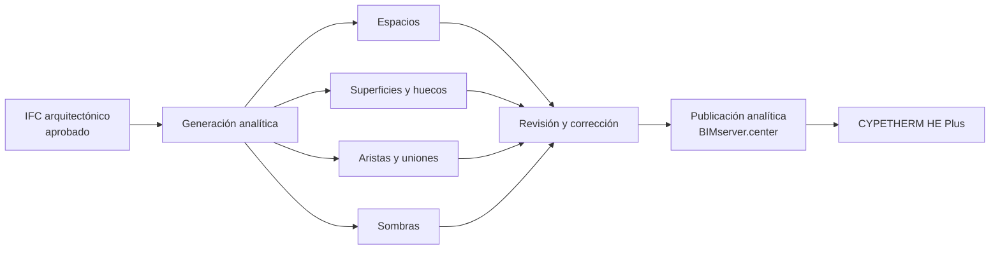

# Open BIM Analytical Model

Open BIM Analytical Model transforma un modelo arquitectónico físico en un modelo geométrico analítico apto para aplicaciones térmicas y acústicas. El resultado no es una copia simplificada automática que pueda aceptarse sin revisión: es una nueva capa de información, editable y versionable, con espacios, superficies, colindancias, aristas, uniones y sombras.

!!! warning "La generación automática no constituye una aprobación"
    El algoritmo puede producir un modelo completo y, aun así, asignar una superficie al elemento incorrecto, interpretar una partición como exterior o crear fragmentos residuales. Todo resultado debe superar el control descrito en este capítulo antes de transferirse a CYPETHERM HE Plus.

## 1. Posición dentro del flujo

Se distinguen tres modelos:

1. **Modelo físico:** geometría arquitectónica contenida en la aportación IFC.
2. **Modelo analítico:** recintos y superficies relacionados para el cálculo.
3. **Modelo energético:** construcciones, condiciones operacionales, sistemas y datos reglamentarios utilizados finalmente por CYPETHERM.

Corregir el analítico no modifica automáticamente el RVT ni el IFC arquitectónico. Cuando la incidencia representa un defecto de origen, debe corregirse también en Revit para que no reaparezca en la siguiente actualización.

## 2. Fuentes y vigencia

Este capítulo se basa en:

- El manual oficial *Open BIM Analytical Model. Manual de uso* facilitado para la guía.
- La página oficial vigente del programa.
- La FAQ oficial **Requisitos del IFC para el generador del modelo analítico**, identificada por CYPE con la versión 2022.f.
- El listado oficial de incidencias y el historial de actualizaciones.

La FAQ 2022.f contiene convenciones de clasificación todavía publicadas por CYPE, pero no se asumirán invariables. Cada combinación de Revit, plugin, esquema IFC y Open BIM Analytical Model debe comprobarse con el modelo de referencia.

## 3. Entrada obligatoria

La obra se vinculará únicamente a una aportación arquitectónica cuyo IFC haya alcanzado el estado `IFC_APROBADO`.

Datos que deben registrarse antes de importar:

| Dato | Finalidad |
|---|---|
| Proyecto BIMserver.center | Evitar usar un proyecto homónimo o de pruebas |
| Identificador de aportación | Trazar el modelo físico utilizado |
| Autor y aplicación de origen | Determinar responsabilidad y configuración |
| Fecha y revisión | Reproducir la generación |
| Esquema IFC | Interpretar entidades y tipos |
| Hash SHA-256 | Garantizar identidad del archivo |
| Informe QA/QC | Conocer incidencias y excepciones aceptadas |
| Versión de Open BIM Analytical Model | Repetir el ensayo |

Si se seleccionan varias aportaciones, debe indicarse cuál contiene los espacios y cuál aporta únicamente contexto, estructura o sombras.

## 4. Requisitos del IFC según CYPE

### 4.1 Referencias de tipo

Los espacios y elementos constructivos deben disponer de referencias de tipo si se pretende que las superficies analíticas queden agrupadas y puedan asociarse posteriormente a soluciones constructivas.

Una geometría visible sin tipo reconocible puede generar una superficie sin referencia, obligando a clasificarla manualmente.

### 4.2 Separación por condición de contorno

Un mismo elemento físico no debería mezclar tramos interiores, exteriores o en contacto con terreno cuando el receptor necesite clasificarlos de forma diferente.

Ejemplos de riesgo:

- Muro continuo con una parte enterrada y otra exterior.
- Forjado único con una zona sobre terreno y otra sobre un espacio.
- Muro que combina medianería y fachada.
- Cubierta que incluye una parte exterior y otra bajo un volumen superior.

La división debe mantener continuidad geométrica y tipos controlados. No se dividirá indiscriminadamente si el receptor resuelve correctamente la condición mediante espacios y superficies; se verificará con el ensayo.

### 4.3 Propiedad `IsExternal`

CYPE utiliza `IsExternal` para interpretar diversas categorías. Una partición interior marcada como exterior puede impedir la detección de su colindancia y producir una superficie exterior incorrecta.

La propiedad debe ser coherente, al menos, en:

- Muros.
- Forjados o losas.
- Puertas.
- Ventanas.

No se utilizará `IsExternal` como único criterio de clasificación energética. Se contrastará con los espacios situados a ambos lados y con la condición de terreno o medianería.

### 4.4 Elementos en contacto con terreno

Los muros y losas en contacto con terreno deben distinguirse de los elementos exteriores expuestos al aire. La documentación CYPE utiliza convenciones como:

- `IfcSlab` con tipo de usuario `BASESLAB`.
- `IfcWall` con tipo de usuario `BASEMENTWALL`.
- `IfcWall` con tipo de usuario `PARTYWALL` para medianerías.

Estas convenciones pueden depender del esquema IFC y del mapeado del plugin. Se registrará su representación exacta en IFC2x3 e IFC4 antes de convertirlas en requisito bloqueante de IDS.

### 4.5 Espacios

El IFC debe contener `IfcSpace` con geometría tridimensional calculable. Durante la generación, las caras del espacio se transforman en superficies analíticas.

Debe comprobarse:

- Identificador y nombre.
- Planta y posición.
- Geometría cerrada.
- Área y volumen.
- Ausencia de intersecciones.
- Relación con cerramientos y huecos.

### 4.6 Coplanaridad

Las caras del espacio deben ser coplanares con las caras correspondientes de muros, forjados, cubiertas y otros elementos físicos. Si existe un desfase, el generador puede crear la superficie, pero no asignarle correctamente la referencia constructiva.

Casos frecuentes:

- Habitación calculada al eje y muro interpretado por una cara.
- Acabado independiente que desplaza el contorno.
- Pilar delimitador que fragmenta el perímetro.
- Suelo de acabado separado del forjado.
- Espacio que termina bajo un falso techo cuando la frontera real es la cubierta.
- Pequeños desniveles entre espacios comunicados.

La coplanaridad será objeto de un ensayo geométrico específico; no puede verificarse mediante IDS 1.0.

### 4.7 Conexiones virtuales

Cuando dos espacios estén comunicados sin elemento físico separador, sus superficies de contacto deben ser coplanares. De lo contrario pueden aparecer superficies incorrectas asociadas a un elemento constructivo inexistente.

Se revisarán especialmente:

- Dobles alturas.
- Escaleras abiertas.
- Pasillos conectados.
- Huecos verticales.
- Recintos de ascensor.
- Grandes espacios divididos funcionalmente.

### 4.8 Área y volumen

CYPE documenta la lectura de cantidades desde `Qto_SpaceBaseQuantities`. Cuando no están disponibles, el programa puede deducirlas de la geometría analítica generada.

La comparación debe registrar por espacio:

- Área de Revit.
- Volumen de Revit.
- Cantidades IFC, si existen.
- Área analítica.
- Volumen analítico.
- Diferencias absolutas y relativas.

La deducción geométrica es una alternativa de cálculo, no una justificación para omitir cantidades IFC sin conocer la causa.

### 4.9 Sombras

La documentación CYPE requiere `IfcShadingDevice` para reconocer elementos de sombra propios o remotos. Desde Revit será necesario comprobar el mapeado de las categorías utilizadas para voladizos, lamas, edificios próximos y obstáculos.

No todo elemento exterior debe convertirse en sombra. Se excluirán objetos decorativos o demasiado detallados que no modifiquen de forma relevante la radiación incidente.

## 5. Entidades físicas que puede interpretar el generador

La documentación oficial relaciona el modelo analítico con las siguientes entidades IFC:

| Función física | Entidades o propiedades candidatas |
|---|---|
| Cubiertas y voladizos | `IfcRoof`; determinados `IfcSlab` exteriores |
| Forjados entre plantas | `IfcSlab`, normalmente no exterior |
| Soleras | `IfcSlab` clasificado como `BASESLAB` |
| Particiones | `IfcWall`, incluido `PARTITIONING` |
| Muros enterrados | `IfcWall` clasificado como `BASEMENTWALL` |
| Muros exteriores | `IfcWall` con `IsExternal = TRUE` |
| Medianerías | `IfcWall` clasificado como `PARTYWALL` |
| Muros cortina | `IfcCurtainWall` |
| Elementos estructurales | `IfcColumn`, `IfcBeam` |
| Puertas y ventanas | `IfcDoor`, `IfcWindow` y condición exterior/interior |
| Huecos | `IfcOpeningElement` |
| Sombras | `IfcShadingDevice` |
| Espacios | `IfcSpace` |

Que una entidad pueda leerse no implica que deba delimitar un espacio. Los pilares interiores, por ejemplo, pueden existir como `IfcColumn` sin formar parte del contorno del recinto.

## 6. Creación o apertura de la obra

Procedimiento inicial:

1. Abrir Open BIM Analytical Model e iniciar sesión.
2. Crear una obra nueva o seleccionar una existente.
3. Vincularla al proyecto correcto de BIMserver.center.
4. Seleccionar la aportación arquitectónica aprobada.
5. Incorporar solo las aportaciones auxiliares necesarias.
6. Confirmar unidades, orientación y posición.
7. Guardar una captura o registro del panel de importación.
8. Anotar la versión del programa.

Antes de generar debe comprobarse visualmente que las plantas, recintos y cerramientos coinciden con el IFC revisado.

## 7. Componentes del modelo analítico

### 7.1 Espacios

Son los volúmenes de cálculo. Habitualmente derivan de recintos arquitectónicos, pero pueden agruparse, simplificarse o subdividirse cuando el cálculo lo justifique.

Propiedades principales:

- Referencia.
- Referencia de tipo.
- Ubicación interior o ambiente exterior.
- Superficie.
- Volumen.

### 7.2 Superficies

Representan los principales vectores de transferencia térmica y acústica.

Debe controlarse:

- Referencia y tipo.
- Condición opaca o acristalada.
- Pertenencia a un hueco.
- Condición exterior.
- Espacio propietario.
- Superficie colindante.
- Disposición horizontal o vertical.
- Condición de suelo o techo.
- Área, orientación, inclinación y perímetro.

### 7.3 Aristas y uniones

Las aristas relacionan dos superficies de un espacio y permiten formar uniones con aristas correspondientes de otros espacios. Son necesarias para interpretar encuentros y transmisiones laterales, y pueden intervenir en el tratamiento de puentes térmicos.

### 7.4 Sombras

- **Propias:** pertenecen al edificio, como aleros o voladizos.
- **Remotas:** proceden del entorno, como edificios próximos.

No representan cerramientos transmisores; su función es obstruir la radiación.

### 7.5 Grupos de espacios

Permiten mantener agrupaciones distintas sobre el mismo modelo, por ejemplo:

- Unidades de uso.
- Zonas térmicas.
- Sectores funcionales.
- Agrupaciones acústicas.

Un grupo no sustituye a la geometría ni a las colindancias de sus espacios miembros.

## 8. Estrategias de generación

Open BIM Analytical Model permite generar el analítico completo y también regenerar componentes concretos.

### 8.1 Reconstrucción mediante recintos y elementos físicos

El algoritmo analiza espacios y elementos constructivos para crear superficies, asociarlas a tipos, determinar colindancias y generar aristas.

Se utilizará cuando:

- Los espacios IFC son válidos.
- Los elementos físicos están bien clasificados.
- Se necesita que el generador reconstruya las relaciones.
- Los contornos IFC no contienen límites suficientemente fiables.

### 8.2 Utilización de contornos IFC

La opción **Utilizar los contornos de los espacios definidos en el modelo IFC** aprovecha directamente la definición disponible en el archivo.

Se ensayará cuando:

- La geometría de `IfcSpace` ha superado QA/QC.
- El contorno IFC es más estable que la reconstrucción.
- Existen geometrías inclinadas o complejas correctamente exportadas.
- Se desea comparar ambos métodos.

No se activará automáticamente por el mero hecho de existir `IfcSpace`.

### 8.3 Matriz de decisión

| Situación | Estrategia candidata |
|---|---|
| Espacios IFC cerrados y coplanares con cerramientos | Ensayar uso de contornos IFC |
| Espacios válidos pero límites espaciales ausentes | Ensayar ambas estrategias |
| Espacios con geometría defectuosa | Corregir primero en Revit |
| Elementos físicos mal clasificados | Corregir mapeado y volver a publicar |
| Caso aislado difícil de reconstruir | Corrección manual documentada |
| Modelo con muchas correcciones manuales repetidas | Revisar el origen; no normalizar la reparación |

## 9. Generación inicial controlada

Se conservará una copia o revisión de la obra antes de cada ensayo.

Procedimiento:

1. Seleccionar **Modelo analítico**.
2. Elegir expresamente los recintos que participarán.
3. Registrar si se generan superficies exteriores.
4. Registrar si se generan aristas.
5. Registrar si se generan sombras.
6. Registrar si se utilizan contornos IFC.
7. Ejecutar la generación.
8. Actualizar los árboles de espacios y superficies.
9. Mostrar todas las incidencias.
10. Guardar el resultado como candidato, no como aprobado.

Para comparar estrategias, se partirá del mismo IFC y de una obra limpia. No se comparará una generación nueva con otra que conserve correcciones manuales anteriores.

## 10. Revisión de espacios

Por cada espacio debe comprobarse:

- Existe una única vez.
- Corresponde al recinto previsto.
- Tiene referencia y tipo.
- Está asignado a la planta y grupo correctos.
- Área y volumen son válidos.
- Su volumen es cerrado.
- No intersecta con otro espacio.
- No contiene fragmentos causados por pilares.
- Representa correctamente dobles alturas, huecos y plénums.

### 10.1 Ambiente exterior

La ubicación exterior representa el espacio externo al edificio. No debe confundirse con:

- Espacio interior no acondicionado.
- Cámara ventilada.
- Garaje.
- Patio cubierto.
- Recinto abierto parcialmente.

La frontera debe revisarse según la condición física que utilizará CYPETHERM.

## 11. Revisión de superficies

### 11.1 Integridad

Cada cara significativa del espacio debe tener una superficie analítica y cada superficie debe pertenecer a un espacio.

Se buscarán:

- Caras ausentes.
- Superficies duplicadas.
- Polígonos degenerados.
- Aristas de longitud cero.
- Fragmentos muy pequeños.
- Superficies fuera del contorno.

### 11.2 Referencia física

La superficie debe heredar o mantener una referencia que permita asignar la construcción correcta. Una superficie sin tipo no se aprobará salvo que el receptor la ignore justificadamente.

### 11.3 Colindancias

Dos superficies que separan espacios deben estar relacionadas como colindantes. Se verificará:

- Coincidencia geométrica suficiente.
- Áreas compatibles.
- Sentidos opuestos de las normales, cuando pueda comprobarse.
- Espacios distintos a ambos lados.
- Ausencia de condición exterior simultánea.

Una superficie interior sin pareja puede convertirse erróneamente en fachada o superficie adiabática en el programa receptor.

### 11.4 Exterior, terreno y medianería

No se agruparán bajo una única categoría:

- Exterior al aire.
- Contacto con terreno.
- Medianería.
- Espacio no acondicionado.
- Otro espacio acondicionado.

Si Open BIM Analytical Model no conserva toda la semántica necesaria, la clasificación final deberá completarse y verificarse en CYPETHERM.

## 12. Huecos y superficies acristaladas

Un hueco requiere coherencia entre:

- Superficie anfitriona.
- Polígono del hueco.
- Superficie asignada al hueco.
- Espacio propietario.
- Colindancia.
- Tipo opaco o acristalado.

Se comprobarán puertas, ventanas, lucernarios, muros cortina y aberturas sin carpintería.

Si un hueco no se genera automáticamente, puede introducirse y asociarse manualmente. La corrección debe registrarse y revisarse en la siguiente actualización; si se repite, se corregirá la familia, el hospedaje o el mapeado IFC en Revit.

## 13. Revisión de aristas y uniones

Las aristas se comprobarán después de aprobar las superficies.

Controles:

- Longitud mayor que la tolerancia mínima.
- Dos superficies convergentes correctamente asignadas.
- Ángulo coherente.
- Espacio propietario correcto.
- Unión con las aristas equivalentes cuando proceda.
- Ausencia de duplicados.

No tiene sentido reparar aristas de forma exhaustiva mientras existan superficies incorrectas, porque una regeneración posterior puede invalidarlas.

## 14. Revisión de sombras

### 14.1 Sombras propias

Revisar:

- Aleros.
- Voladizos.
- Lamas fijas.
- Petos relevantes.
- Retranqueos y cuerpos salientes.

### 14.2 Sombras remotas

Revisar:

- Edificios próximos.
- Muros exteriores del entorno.
- Obstáculos significativos.
- Relieve simplificado, cuando proceda.

### 14.3 Simplificación

Las sombras deben conservar posición, orientación y silueta relevante sin trasladar detalle constructivo innecesario. Se comparará su efecto mediante un ensayo de sensibilidad en CYPETHERM cuando exista duda.

## 15. Sistema de incidencias

La versión actual del programa dispone de revisión de errores y advertencias. Entre las incidencias documentadas por CYPE se encuentran:

- Espacio sin volumen válido.
- Propiedades incompatibles entre un hueco y su superficie anfitriona.
- Superficie sin referencia.
- Elemento físico sin superficie analítica.

Clasificación recomendada:

| Severidad | Criterio |
|---|---|
| Bloqueante | Impide formar un volumen o una frontera calculable |
| Mayor | Altera área, colindancia, orientación o construcción |
| Menor | No cambia previsiblemente el cálculo, pero reduce trazabilidad |
| Informativa | Requiere confirmación sin evidencia de error |

No se ocultarán advertencias para presentar un modelo aparentemente limpio.

## 16. Correcciones manuales

El programa permite crear, editar, mover, unir, dividir y borrar componentes; establecer colindancias; crear huecos; asignar superficies; y editar propiedades de los elementos físicos utilizados como plantilla.

Toda corrección manual debe registrar:

- Elemento afectado.
- Estado anterior y posterior.
- Causa.
- Responsable.
- Incidencia de origen en Revit, si existe.
- Riesgo de perderse al actualizar.
- Evidencia gráfica.

### 16.1 Corrección admitida

Puede admitirse cuando representa una decisión analítica deliberada, por ejemplo:

- Unir superficies equivalentes.
- Simplificar un retranqueo irrelevante.
- Crear una sombra analítica equivalente.
- Agrupar espacios sin modificar su geometría base.

### 16.2 Corrección que debe volver a Revit

- Espacio ausente o abierto.
- Solape entre habitaciones.
- Hueco sin hospedaje correcto.
- Elemento interior marcado como exterior.
- Coordenadas u orientación erróneas.
- Pilar que fragmenta el contorno.
- Cerramiento duplicado.

## 17. Actualización y regeneración

La vinculación con BIMserver.center permite actualizar los datos cuando cambia la aportación arquitectónica. Una actualización puede afectar tanto a elementos generados automáticamente como a correcciones manuales.

Antes de actualizar:

1. Registrar la revisión analítica actual.
2. Exportar o conservar evidencias.
3. Identificar qué cambió en el IFC.
4. Clasificar las correcciones manuales existentes.
5. Crear una copia de trabajo.

Después de actualizar:

1. Comprobar espacios añadidos, eliminados y modificados.
2. Comparar superficies y colindancias.
3. Revisar huecos.
4. Regenerar aristas después de aprobar superficies.
5. Revisar sombras.
6. Reaplicar únicamente las decisiones analíticas justificadas.
7. Generar un nuevo informe QA/QC.

No se aprobará una actualización solo porque el programa abra la obra sin errores.

## 18. Estrategias frente a cambios

| Tipo de cambio | Estrategia inicial |
|---|---|
| Solo propiedades de tipos | Actualizar y comprobar referencias |
| Cambio pequeño de un hueco | Revisar anfitrión, superficie y sombra |
| Cambio de perímetro o altura | Regenerar espacios y superficies afectados |
| Cambio de niveles | Revisar todo el sector vertical |
| Nueva planta o volumen | Regeneración controlada completa |
| Cambio de coordenadas | Detener el flujo y corregir antes de continuar |
| Cambio masivo de identificadores | Comparar por geometría y códigos; investigar origen |

## 19. Criterios de aceptación

El modelo analítico podrá declararse `ANALITICO_APROBADO` cuando:

- Todos los espacios de cálculo estén identificados.
- Áreas y volúmenes cumplan las tolerancias del proyecto.
- No existan espacios solapados.
- Todas las superficies necesarias estén presentes.
- No existan duplicados relevantes.
- Colindancias interiores estén completas.
- Exterior, terreno y medianería estén diferenciados.
- Huecos y acristalamientos estén asociados correctamente.
- Las referencias permitan asignar construcciones.
- Aristas y uniones requeridas sean coherentes.
- Sombras aprobadas estén presentes y simplificadas.
- No existan incidencias bloqueantes o mayores sin resolver.
- Todas las correcciones manuales estén registradas.

## 20. Informe de comparación

Se generará una tabla por revisión:

| Métrica | Revit | IFC | Analítico | Diferencia/estado |
|---|---:|---:|---:|---|
| Espacios |  |  |  |  |
| Área total |  |  |  |  |
| Volumen total |  |  |  |  |
| Muros o superficies verticales |  |  |  |  |
| Forjados/suelos |  |  |  |  |
| Cubiertas/techos |  |  |  |  |
| Huecos |  |  |  |  |
| Colindancias | N/A |  |  |  |
| Aristas | N/A | N/A |  |  |
| Sombras |  |  |  |  |

Los totales no sustituyen la revisión individual de los casos de riesgo.

## 21. Ensayo de estrategias

Con el mismo IFC aprobado se generarán, como mínimo:

- **Ensayo A:** reconstrucción sin utilizar contornos IFC.
- **Ensayo B:** utilización de contornos IFC.

Se compararán:

- Espacios generados.
- Superficies y fragmentación.
- Colindancias.
- Asignación de referencias físicas.
- Huecos.
- Aristas.
- Sombras.
- Incidencias.
- Tiempo de corrección manual.
- Estabilidad tras una actualización.

La estrategia seleccionada puede variar por tipología, pero no se mezclará dentro de una misma entrega sin documentar el alcance.

## 22. Errores frecuentes

| Síntoma | Causa probable | Revisión inicial |
|---|---|---|
| Espacio sin volumen | Geometría abierta o degenerada | `IfcSpace`, límites y niveles |
| Superficie sin referencia | Falta de tipo o ausencia de coplanaridad | Elemento físico y contorno |
| Partición interpretada como exterior | `IsExternal` incorrecto o falta de pareja | Propiedades y espacio opuesto |
| Terreno interpretado como exterior | Clasificación insuficiente | Tipo IFC y condición de contorno |
| Colindancia ausente | Superficies no coincidentes | Geometría de ambos espacios |
| Hueco desaparecido | Hospedaje, abertura o superficie incompatible | `IfcOpeningElement` y anfitrión |
| Demasiadas superficies pequeñas | Pilares, acabados o geometría detallada | Modelo Revit y tolerancias |
| Aristas de longitud cero | Superficies degeneradas o duplicadas | Reparar primero superficies |
| Sombra ausente | Categoría no mapeada como `IfcShadingDevice` | Mapeado IFC |
| Cambio perdido al actualizar | Corrección manual no trazada | Registro y estrategia de regeneración |

## 23. Checklist final

- [ ] La obra usa la aportación IFC aprobada y su hash está registrado.
- [ ] La versión de Open BIM Analytical Model está identificada.
- [ ] La estrategia de generación está documentada.
- [ ] Todos los espacios tienen referencia, área y volumen válidos.
- [ ] No existen espacios duplicados, contenidos o solapados.
- [ ] Las superficies están completas y sin duplicidades relevantes.
- [ ] Los tipos físicos están correctamente asignados.
- [ ] Las colindancias interiores están revisadas.
- [ ] Exterior, terreno, medianería y espacio no acondicionado se distinguen.
- [ ] Los huecos tienen superficie y anfitrión coherentes.
- [ ] Las aristas y uniones necesarias son válidas.
- [ ] Las sombras propias y remotas están controladas.
- [ ] No existen incidencias bloqueantes o mayores pendientes.
- [ ] Las correcciones manuales están registradas.
- [ ] La revisión analítica se ha publicado en BIMserver.center.
- [ ] CYPETHERM HE Plus puede identificar la aportación aprobada.

## 24. Fuentes

- CYPE, [Open BIM Analytical Model](https://info.cype.com/es/software/open-bim-analytical-model/), consulta del 13 de julio de 2026.
- CYPE Learning, [Requisitos del IFC para el generador del modelo analítico](https://learning.cype.com/es/faq/requisitos-del-ifc-para-el-generador-del-modelo-analitico/), referencia identificada como versión 2022.f.
- CYPE, [Listado de incidencias de Open BIM Analytical Model](https://info.cype.com/es/tema/open-bim-analytical-model-listado-de-incidencias/), consulta del 13 de julio de 2026.
- CYPE, *Open BIM Analytical Model. Manual de uso*, archivo `ob_analytical_01.pdf` facilitado para esta guía.

