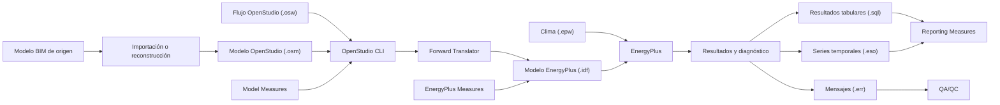

# Arquitectura OpenStudio–EnergyPlus

| Campo | Valor |
|---|---|
| Software | OpenStudio SDK 3.11.0 |
| Motor | EnergyPlus 25.2.0 |
| Fecha de revisión | 2026-07-15 |
| Estado | Confirmado para la arquitectura general |
| Flujo BIM de entrada | Pendiente de validación |

OpenStudio no sustituye al motor de cálculo. Su función es representar, transformar, automatizar y ejecutar un modelo que finalmente se traduce al formato de entrada de EnergyPlus.

## Cadena de procesamiento

## Componentes principales

### Modelo OpenStudio (`.osm`)

Es la representación orientada a objetos del edificio. Puede contener un modelo parcial o completo y organiza geometría, espacios, zonas térmicas, construcciones, cargas, horarios y sistemas. El archivo OSM es texto estructurado según el esquema de OpenStudio.

!!! important "Modelo editable, no garantía de simulación"
    Un archivo OSM puede ser válido como contenedor de datos y aun no estar preparado para simular. Deben comprobarse relaciones, datos obligatorios y coherencia física antes de traducirlo.

### Flujo OpenStudio (`.osw`)

El archivo OSW describe una ejecución reproducible: modelo semilla, archivo meteorológico, rutas de medidas, secuencia de pasos y argumentos. Debe conservarse junto al caso de prueba cuando intervengan medidas o automatizaciones.

### OpenStudio CLI

La interfaz de línea de comandos coordina el flujo. Carga el modelo, aplica las medidas en su orden, realiza la traducción y lanza EnergyPlus. El éxito del comando no sustituye la revisión de advertencias y resultados.

### Traductor hacia EnergyPlus

El *Forward Translator* convierte el modelo OpenStudio a un archivo IDF compatible con EnergyPlus. La traducción puede transformar o añadir objetos para producir una entrada simulable; por ello, OSM e IDF no deben compararse como si fueran copias idénticas.

La traducción inversa desde IDF a OSM existe, pero puede perder información, especialmente en sistemas HVAC. No se utilizará como procedimiento de ida y vuelta sin comprobar advertencias, errores y objetos no traducidos.

### EnergyPlus

EnergyPlus recibe el IDF, el archivo climático EPW y los recursos asociados. Ejecuta el cálculo y genera, entre otros, diagnósticos en `.err`, resultados tabulares en SQLite y series temporales en `.eso` cuando se solicitan.

## Tipos de medidas

| Tipo | Momento de ejecución | Uso |
|---|---|---|
| Model Measure | Antes de traducir | Modificar o comprobar el modelo OSM |
| EnergyPlus Measure | Después de traducir y antes de simular | Modificar el modelo IDF |
| Reporting Measure | Después de simular | Analizar salidas y producir informes |

Las medidas forman parte del procedimiento reproducible. Cada una debe registrar nombre, versión, argumentos y resultado de ejecución.

## Puertas de control

1. **Entrada BIM:** geometría, espacios, orientación y unidades.
2. **Modelo OSM:** superficies, adyacencias, zonas, construcciones, cargas y sistemas.
3. **Traducción:** advertencias, errores y objetos omitidos por el traductor.
4. **Ejecución EnergyPlus:** errores graves y advertencias del archivo `.err`.
5. **Resultados:** balances, horas no satisfechas, magnitudes, unidades y coherencia física.

Un flujo se considerará reproducible cuando permita reconstruir los mismos archivos de entrada, ejecutar la misma secuencia y explicar las diferencias relevantes entre resultados.

## Fuentes

- [OpenStudio Model](https://openstudio-sdk-documentation.s3.amazonaws.com/cpp/OpenStudio-3.9.0-doc/model/html/classopenstudio_1_1model_1_1_model.html).
- [Traductor OpenStudio–EnergyPlus](https://openstudio-sdk-documentation.s3.amazonaws.com/cpp/OpenStudio-3.6.1-doc/energyplus/html/index.html).
- [Repositorio oficial de OpenStudio](https://github.com/NatLabRockies/OpenStudio).
- [Repositorio oficial de EnergyPlus](https://github.com/NatLabRockies/EnergyPlus).

## Pendiente de validación

La guía todavía debe determinar cómo se obtiene el primer OSM desde Revit y qué información se conserva en cada alternativa. Ese trabajo corresponde al flujo de intercambio y no se presupone resuelto por esta arquitectura.
