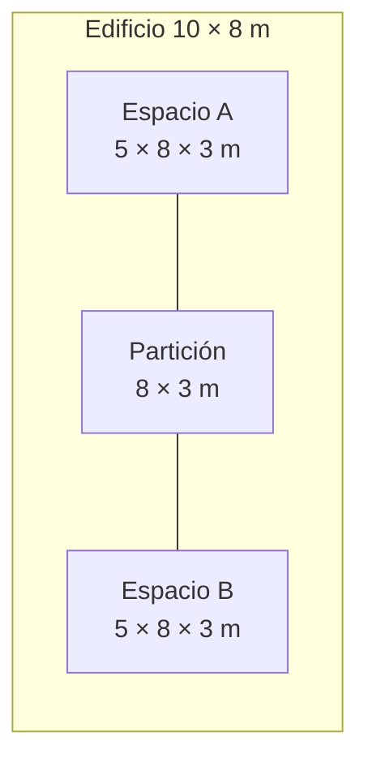

# Caso mínimo de referencia

| Campo | Valor |
|---|---|
| Identificador | `OS-MIN-001` |
| Nombre | Dos espacios adyacentes |
| Estado | Especificado; OSM pendiente de generación |
| Revit | 2026 |
| OpenStudio | 3.11.0 |
| EnergyPlus | 25.2.0 |
| Fecha de revisión | 2026-07-15 |

El primer caso de prueba debe ser suficientemente pequeño para localizar errores, pero debe incluir una adyacencia interior, cerramientos exteriores y huecos. Sus magnitudes se mantienen en `data/casos-prueba.yml` para permitir comprobaciones automáticas posteriores.

!!! warning "Modelo todavía no generado"
    Esta página define el modelo que debe construirse. En el entorno de trabajo actual no se ha localizado OpenStudio CLI ni un archivo OSM existente. El caso no se declarará validado hasta conservar y ejecutar los artefactos indicados.

## Geometría

El edificio es un prisma rectangular de **10 × 8 × 3 m**, dividido en dos espacios iguales por un cerramiento interior.



- Una planta a cota 0,00 m.
- Cubierta horizontal a 3,00 m.
- Dos espacios de 5 × 8 × 3 m.
- Una zona térmica independiente por espacio.
- Fachada principal orientada al sur.
- Una ventana de 2 × 1,5 m en la fachada sur de cada espacio.
- Sin sombras, voladizos, pilares, falsos techos ni elementos decorativos.

## Resultados geométricos esperados

| Magnitud | Valor esperado |
|---|---:|
| Superficie útil total | 80 m² |
| Volumen total | 240 m³ |
| Superficie de cubierta | 80 m² |
| Superficie de suelo | 80 m² |
| Muros exteriores brutos | 108 m² |
| Partición interior compartida | 24 m² |
| Ventanas | 2 |
| Superficie total de ventanas | 6 m² |

Las áreas de muros exteriores se registran inicialmente en bruto para evitar confundir el área geométrica de la superficie base con el área opaca neta tras descontar huecos.

## Convenciones de identificación

| Objeto | Identificador |
|---|---|
| Edificio | `OS-MIN-001` |
| Espacios | `SPACE-A`, `SPACE-B` |
| Zonas térmicas | `TZ-A`, `TZ-B` |
| Ventanas | `WIN-A-S`, `WIN-B-S` |
| Partición | `PART-A-B` |

Los nombres deben mantenerse, cuando el formato lo permita, para facilitar la comparación entre Revit, gbXML, OSM e IDF. Los identificadores nativos, como `UniqueId`, GUID o *handle*, se registrarán por separado y no se sustituirán por estos nombres legibles.

## Condiciones mínimas de simulación

La primera ejecución utilizará deliberadamente supuestos sencillos:

- archivo climático de referencia para Madrid-Barajas, pendiente de seleccionar y versionar;
- construcciones homogéneas claramente identificadas;
- cargas internas y horarios idénticos en ambos espacios;
- infiltración constante;
- sistema ideal de cargas de aire para separar la envolvente del diseño HVAC;
- periodo anual completo y días de dimensionado compatibles con el archivo climático.

Los valores concretos se fijarán en la tarea de configuración del modelo y no deben introducirse de forma implícita.

## Artefactos obligatorios

```text
OS-MIN-001/
├── source/       modelo Revit y registro de versión
├── exchange/     gbXML exportado
├── workflow/     OSW, medidas y argumentos
├── model/        OSM e IDF generados
├── weather/      referencia y checksum del EPW
├── results/      ERR, SQL e informes
└── evidence/     capturas, recuentos y comparaciones
```

Los archivos binarios o de gran tamaño no se incorporarán automáticamente al repositorio Git. Antes se definirá si deben almacenarse mediante Git LFS, una publicación de GitHub o un repositorio de datos separado.

## Criterios de aceptación

1. Diferencia de áreas igual o inferior al 1 % entre etapas.
2. Diferencia de volúmenes igual o inferior al 1 % entre etapas.
3. Dos espacios y dos zonas térmicas identificables.
4. Una única adyacencia interior coherente entre ambos espacios.
5. Dos ventanas reconocidas en la fachada sur.
6. Ningún error severo de EnergyPlus.
7. Advertencias inventariadas y clasificadas.
8. Ejecución reproducible mediante un OSW versionado.

## Secuencia de construcción

- [ ] Construir el modelo fuente en Revit 2026.
- [ ] Crear y revisar el modelo analítico de energía.
- [ ] Exportar gbXML 7.03.
- [ ] Ejecutar las medidas de importación.
- [ ] Guardar el OSM resultante.
- [ ] Traducir y ejecutar con EnergyPlus.
- [ ] Comparar los resultados con esta especificación.
- [ ] Registrar desviaciones e incidencias.

## Estado de cierre

La especificación documental está terminada. La tarjeta continuará abierta hasta disponer al menos del OSM, el OSW, el IDF y una ejecución sin errores severos.
