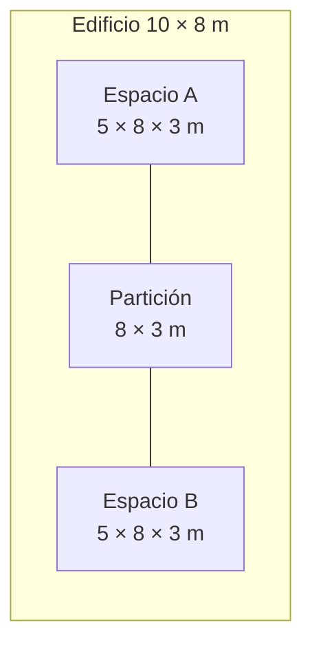

# Caso mínimo de referencia

| Campo | Valor |
|---|---|
| Identificador | `OS-MIN-001` |
| Nombre | Dos espacios adyacentes |
| Estado | OSM generado y ejecución de control superada |
| Revit | 2026 |
| OpenStudio | 3.11.0 |
| EnergyPlus | 25.2.0 |
| Fecha de revisión | 2026-07-15 |

El primer caso de prueba debe ser suficientemente pequeño para localizar errores, pero debe incluir una adyacencia interior, cerramientos exteriores y huecos. Sus magnitudes se mantienen en `data/casos-prueba.yml` para permitir comprobaciones automáticas posteriores.

!!! success "Ejecución de control"
    El modelo se ha generado con OpenStudio 3.11.0 y se ha ejecutado durante los días de diseño y el periodo anual con EnergyPlus 25.2.0. La ejecución TMYx termina correctamente con 0 errores severos y 11 advertencias inventariadas.

## Geometría

El edificio es un prisma rectangular de **10 × 8 × 3 m**, dividido en dos espacios iguales por un cerramiento interior.



- Una planta a cota 0,00 m.
- Cubierta horizontal a 3,00 m.
- Dos espacios de 5 × 8 × 3 m.
- Una zona térmica independiente por espacio.
- Fachada principal orientada al sur.
- Una ventana de 2 × 1,5 m en la fachada sur de cada espacio.
- Sin sombras, voladizos, pilares, falsos techos ni elementos decorativos.

## Resultados geométricos esperados

| Magnitud | Valor esperado |
|---|---:|
| Superficie útil total | 80 m² |
| Volumen total | 240 m³ |
| Superficie de cubierta | 80 m² |
| Superficie de suelo | 80 m² |
| Muros exteriores brutos | 108 m² |
| Partición interior compartida | 24 m² |
| Ventanas | 2 |
| Superficie total de ventanas | 6 m² |

Las áreas de muros exteriores se registran inicialmente en bruto para evitar confundir el área geométrica de la superficie base con el área opaca neta tras descontar huecos.

## Convenciones de identificación

| Objeto | Identificador |
|---|---|
| Edificio | `OS-MIN-001` |
| Espacios | `SPACE-A`, `SPACE-B` |
| Zonas térmicas | `TZ-A`, `TZ-B` |
| Ventanas | `WIN-A-S`, `WIN-B-S` |
| Partición | `PART-A-B` |

Los nombres deben mantenerse, cuando el formato lo permita, para facilitar la comparación entre Revit, gbXML, OSM e IDF. Los identificadores nativos, como `UniqueId`, GUID o *handle*, se registrarán por separado y no se sustituirán por estos nombres legibles.

## Condiciones mínimas de simulación

La primera ejecución utilizará deliberadamente supuestos sencillos:

- archivo climático TMYx 2009–2023 de Madrid-Barajas-Suárez, WMO 082210;
- construcciones homogéneas claramente identificadas;
- cargas internas y horarios idénticos en ambos espacios;
- infiltración constante;
- sistema ideal de cargas de aire para separar la envolvente del diseño HVAC;
- periodo anual completo y días de dimensionado compatibles con el archivo climático.

Los valores de referencia fijados en `create_model.rb` son:

| Grupo | Valor de referencia | Aplicación |
|---|---:|---|
| Cerramientos opacos | R = 2,00 m²·K/W | Todos los cerramientos opacos |
| Huecos | U = 2,00 W/m²·K; g = 0,60 | Dos ventanas sur |
| Ocupación | 0,10 personas/m² | 08:00–18:00 |
| Iluminación | 8 W/m² | 08:00–18:00 |
| Equipos | 10 W/m² | 08:00–18:00 |
| Infiltración | 0,30 renovaciones/h | Continua |
| Aire exterior | 10 l/s por persona | Método suma |
| Consignas | 20 °C calefacción; 26 °C refrigeración | Continua |
| Sistema | Cargas ideales de aire | Una unidad por zona |

Estos datos son deliberadamente simples y sirven para comprobar la interoperabilidad. No representan por sí solos una solución reglamentaria ni un edificio real. Cualquier sustitución debe indicar valor, unidad, fuente, fecha y responsable.

### Archivo climático

El flujo utiliza `ESP_MD_Madrid-Barajas-Suarez.AP.082210_TMYx.2009-2023.epw`, distribuido por [Climate.OneBuilding.Org](https://climate.onebuilding.org/WMO_Region_6_Europe/ESP_Spain/). El EPW no se almacena en Git: `weather/download_weather.ps1` descarga el paquete y valida tanto su hash como el del archivo extraído.

| Dato | Valor |
|---|---|
| Estación | Madrid-Barajas-Suárez AP |
| WMO | 082210 |
| Periodo fuente | 2009–2023 |
| Tipo | TMYx |
| Coordenadas EPW | 40,467°; −3,556° |
| Elevación | 609,6 m |
| SHA-256 EPW | `2137be4961ebe634fe6f09f392ec3a320dfefcff34b4152c155334574bf8ba16` |

## Artefactos obligatorios

```text
OS-MIN-001/
├── source/       modelo Revit y registro de versión
├── exchange/     gbXML exportado
├── workflow/     OSW, medidas y argumentos
├── model/        OSM e IDF generados
├── weather/      referencia y checksum del EPW
├── results/      ERR, SQL e informes
└── evidence/     capturas, recuentos y comparaciones
```

Los archivos binarios o de gran tamaño no se incorporarán automáticamente al repositorio Git. Antes se definirá si deben almacenarse mediante Git LFS, una publicación de GitHub o un repositorio de datos separado.

## Criterios de aceptación

1. Diferencia de áreas igual o inferior al 1 % entre etapas.
2. Diferencia de volúmenes igual o inferior al 1 % entre etapas.
3. Dos espacios y dos zonas térmicas identificables.
4. Una única adyacencia interior coherente entre ambos espacios.
5. Dos ventanas reconocidas en la fachada sur.
6. Ningún error severo de EnergyPlus.
7. Advertencias inventariadas y clasificadas.
8. Ejecución reproducible mediante un OSW versionado.

## Secuencia de construcción

- [ ] Construir el modelo fuente en Revit 2026.
- [ ] Crear y revisar el modelo analítico de energía.
- [ ] Exportar gbXML 7.03.
- [ ] Ejecutar las medidas de importación.
- [ ] Guardar el OSM resultante.
- [ ] Traducir y ejecutar con EnergyPlus.
- [ ] Comparar los resultados con esta especificación.
- [ ] Registrar desviaciones e incidencias.

## Estado de cierre

La geometría se genera mediante `create_model.rb` y se verifica con `verify_model.rb`. El repositorio conserva el OSM y el OSW; el IDF, los diagnósticos y la base SQL se regeneran en el directorio ignorado `run/`.

Resultados de la ejecución de control:

- 2 espacios y 2 zonas térmicas;
- 12 superficies y 2 ventanas;
- traducción OSM–IDF completada;
- EnergyPlus 25.2.0 completado correctamente;
- 0 errores severos y 7 advertencias;
- construcciones, cargas, horarios, ventilación y sistema ideal configurados en `BEM-57`;
- EPW TMYx descargado y validado mediante SHA-256;
- simulación anual completada con 0 errores severos y 11 advertencias.
