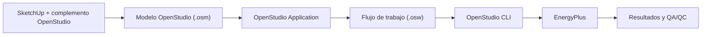

# Flujo SketchUp–OpenStudio–EnergyPlus

Este procedimiento utiliza SketchUp como editor geométrico del modelo OpenStudio. El archivo energético de trabajo es el OSM; el SKP puede conservar vistas y contenido auxiliar, pero no sustituye al OSM.

## Cadena de trabajo



Esta vía es distinta de **Revit → gbXML → OpenStudio**. El flujo con SketchUp edita directamente objetos y geometría del OSM; el flujo con Revit traduce primero un modelo BIM mediante gbXML y exige revisar las pérdidas de esa traducción.

## Ensayo controlado BEM-62

El ensayo parte de `OS-MIN-001`, pero nunca abre ni sobrescribe el modelo de referencia. Preparar las copias desde la raíz del repositorio:

```powershell
./scripts/preparar-ensayo-sketchup.ps1
```

El script crea archivos temporales excluidos de Git:

| Uso | Ruta |
|---|---|
| Entrada para SketchUp | `tmp/bem-62-sketchup-roundtrip/entrada/OS-MIN-001_entrada.osm` |
| Salida del complemento | `tmp/bem-62-sketchup-roundtrip/salida/OS-MIN-001_sketchup.osm` |

## Apertura y revisión geométrica

1. En SketchUp, seleccionar **Extensiones → OpenStudio → Open OpenStudio Model**.
2. Abrir `OS-MIN-001_entrada.osm` desde la ruta anterior.
3. Confirmar que aparecen los dos espacios adyacentes del caso mínimo.
4. Activar la visualización por tipo de superficie y revisar paredes, cubiertas, suelos y la pared interior compartida.
5. No cambiar geometría ni nombres en esta primera prueba; se trata de medir una ida y vuelta sin modificaciones intencionadas.
6. Seleccionar **Extensiones → OpenStudio → Save OpenStudio Model As** y guardar exactamente como `OS-MIN-001_sketchup.osm` en la carpeta de salida.

!!! warning "No usar Guardar de SketchUp como sustituto"
    **Archivo → Guardar** conserva el SKP. Para producir el archivo energético del ensayo debe utilizarse el comando de guardado del complemento OpenStudio y comprobar que la extensión final es `.osm`.

## Validación posterior

Cuando exista el archivo de salida, la comparación debe comprobar como mínimo:

- carga correcta con OpenStudio CLI 3.11.0;
- dos espacios y dos zonas térmicas;
- superficies y adyacencia interior;
- nombres de objetos;
- construcciones, cargas, horarios y sistema de cargas ideales;
- diferencias de texto atribuibles al reordenamiento o serialización.

## Resultado del primer ensayo

El 15 de julio de 2026 se abrió la copia de `OS-MIN-001` con el complemento 1.11.0 en SketchUp 2025 y se guardó un OSM nuevo. OpenStudio CLI 3.11.0 cargó correctamente la salida y el verificador confirmó:

- dos espacios y dos zonas térmicas;
- áreas, volumen, ventanas y nombres sin cambios;
- las dos caras de la partición interior correctamente emparejadas;
- construcciones, cargas, horarios, infiltración, ventilación, termostatos y cargas ideales conservados.

El archivo pasó de 47.756 a 50.482 bytes y su SHA-256 cambió, por lo que no es una copia textual idéntica. La comparación de tipos detectó únicamente un `OS:Facility` y cinco `OS:Rendering:Color` añadidos. Son objetos de organización y visualización; no se detectaron pérdidas en las magnitudes y relaciones verificadas.

El resultado completo y sus hashes se conservan en `data/ensayo-sketchup-openstudio.yml`. El OSM generado permanece como artefacto local temporal en la carpeta de salida del ensayo.

La validación puede repetirse indicando el archivo como argumento:

```powershell
C:/openstudioapplication-1.11.1/bin/openstudio.exe `
  examples/openstudio/OS-MIN-001/verify_model.rb `
  tmp/bem-62-sketchup-roundtrip/salida/OS-MIN-001_sketchup.osm
```

La ampliación de estas comprobaciones y el registro formal de pérdidas corresponden a BEM-63.

## Continuación en OpenStudio Application y EnergyPlus

Tras aceptar la geometría, el OSM se abre en OpenStudio Application para revisar sitio, clima, construcciones, cargas, horarios, zonas y sistemas. La ejecución reproducible se realiza con un OSW y OpenStudio CLI; EnergyPlus recibe el IDF traducido y genera los diagnósticos y resultados. Un guardado correcto en SketchUp no demuestra por sí solo que el modelo sea simulable.
