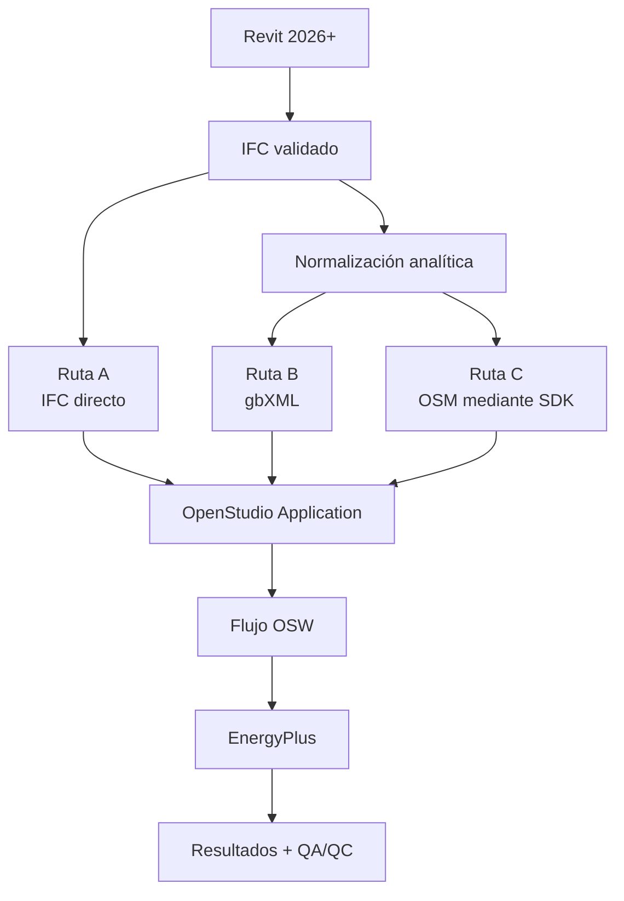

# OpenStudio

OpenStudio es un ecosistema abierto para crear, transformar, ejecutar y analizar modelos energéticos basados en EnergyPlus. En esta guía se estudiará como receptor del modelo preparado en Revit y como plataforma de automatización para construir un modelo energético trazable desde IFC.

!!! warning "OpenStudio no convierte por sí solo un IFC físico en un BEM aprobado"
    La importación directa de IFC está orientada a geometría. Si faltan límites espaciales, colindancias, zonas térmicas o datos operacionales, deben reconstruirse o completarse antes de considerar calculable el modelo.

## 1. Alcance inicial

Este módulo estudiará tres rutas:

1. Importación directa del IFC en OpenStudio Application.
2. Conversión del modelo analítico a gbXML e importación en OpenStudio.
3. Generación directa de un modelo nativo OpenStudio (`.osm`) mediante OpenStudio SDK.

DesignBuilder queda fuera del alcance activo de esta fase. Su sección se conserva como ampliación futura para no perder el control de versiones de la guía.

## 2. Componentes del ecosistema

| Componente | Función |
|---|---|
| OpenStudio SDK | API para crear y modificar modelos energéticos y relacionarlos con EnergyPlus |
| OpenStudio CLI | Ejecución reproducible de modelos, flujos y medidas |
| OpenStudio Application | Interfaz gráfica para geometría, envolvente, cargas, horarios y HVAC |
| OpenStudio Measures | Transformaciones y comprobaciones automatizadas sobre el modelo |
| EnergyPlus | Motor de simulación energética |
| OpenStudio Server/PAT | Análisis paramétricos y ejecución de múltiples alternativas |

OpenStudio SDK y OpenStudio Application tienen ciclos de publicación distintos. Se registrarán sus versiones por separado junto con la versión de EnergyPlus incluida o utilizada.

La web oficial identifica OpenStudio SDK 3.11.0, publicado el 15 de enero de 2026, como versión vigente en la fecha de consulta. Esta referencia deberá actualizarse y ensayarse antes de fijar la versión productiva.

## 3. Formatos relevantes

| Formato | Función en el flujo | Alcance esperado |
|---|---|---|
| IFC | Modelo físico, espacios, tipos, propiedades y relaciones disponibles | La importación OpenStudio se considera geométrica |
| gbXML | Intercambio de espacios, superficies, huecos, construcciones, zonas y determinados horarios | Modelo analítico de transferencia |
| OSM | Modelo nativo de OpenStudio | Geometría y datos energéticos editables |
| OSW | Definición del flujo de ejecución | Modelo semilla, clima, medidas y pasos |
| IDF | Entrada nativa de EnergyPlus | Resultado de la traducción desde OSM |
| EPW | Archivo meteorológico horario | Clima de simulación |

No se utilizarán indistintamente. Cada archivo representa una etapa y debe quedar asociado a su versión, hash y aplicación generadora.

## 4. Las tres rutas candidatas

### 4.1 Ruta A — IFC directo

Ventajas:

- Menos transformaciones previas.
- Inspección rápida del contenido geométrico.
- Útil para localizar problemas del IFC.

Limitaciones:

- La documentación de OpenStudio Application clasifica la importación IFC como **geometría únicamente**.
- No debe esperarse una transferencia completa de construcciones, zonas, horarios o sistemas.
- La geometría física puede no coincidir con las superficies de transferencia necesarias para EnergyPlus.

Se utilizará como referencia y diagnóstico hasta que un ensayo demuestre un alcance superior para la combinación de versiones concreta.

### 4.2 Ruta B — gbXML

Ventajas:

- Formato diseñado para intercambiar espacios, superficies analíticas y adyacencias.
- Puede incorporar construcciones, zonas térmicas y horarios compatibles.
- OpenStudio Application permite inspeccionar el archivo antes de fusionarlo con el OSM.

Limitaciones:

- Es necesario generar previamente superficies y colindancias correctas.
- La traducción gbXML–OSM puede emitir avisos o perder información.
- La función de fusión documentada por OpenStudio todavía no ofrece al usuario control completo sobre cómo se combinan las revisiones.

OpenStudio SDK dispone de un traductor inverso de gbXML que devuelve avisos y errores. El proyecto oficial `gbxml-to-openstudio` desarrolla medidas adicionales porque la traducción base no cubre todos los casos.

### 4.3 Ruta C — OSM mediante SDK

Ventajas:

- Control directo de objetos, relaciones e identificadores.
- Posibilidad de generar y validar el modelo con Python, Ruby, C# o C++ según la distribución utilizada.
- Permite añadir construcciones, tipos de espacio, zonas, cargas, horarios y sistemas sin depender de la cobertura de gbXML.
- Facilita pruebas automáticas y flujos reproducibles.

Limitaciones:

- Requiere desarrollar y mantener un conversor.
- No elimina la necesidad de reconstruir superficies y adyacencias cuando el IFC carece de ellas.
- Debe mantenerse la compatibilidad entre SDK, bindings, OSM y EnergyPlus.

La ruta C es la candidata preferente para la herramienta futura, pero no se aprobará hasta compararla con las rutas A y B sobre el mismo modelo.

## 5. Diagnóstico de los IFC disponibles

El 13 de julio de 2026 se ejecutó el perfil energético de nuestra herramienta QA/QC sobre los dos IFC reales disponibles en `tests/ifc`. Los archivos permanecen ignorados por Git y no se incorporan a la publicación.

| Control | `nave industrial.ifc` | `SUAREZ SOMONTE...ifc` |
|---|---:|---:|
| Aplicación de origen | Revit 2019 | Revit 2024 |
| Esquema | IFC2X3 | IFC2X3 |
| Plantas | 4 | 6 |
| `IfcSpace` | 0 | 17 |
| `IfcZone` | 0 | 0 |
| `IfcRelSpaceBoundary` | 0 | 0 |
| Espacios con área reconocida | N/A | 0 % |
| Espacios con volumen reconocido | N/A | 0 % |
| Espacios con geometría procesable | 0 | 17 |
| Intersecciones detectadas | N/A | 0 |
| Relaciones de materiales | 127 | 167 |

### 5.1 Conclusiones del diagnóstico

El modelo de Revit 2019 no puede iniciar una conversión energética porque no contiene espacios.

El modelo de Revit 2024 sí permite estudiar los sólidos de 17 espacios y no presenta intersecciones superiores a la tolerancia de 2 mm utilizada en el ensayo. Sin embargo:

- No contiene límites espaciales.
- No identifica zonas térmicas.
- No proporciona cantidades de espacio con los nombres reconocidos por el validador.
- No permite certificar automáticamente que los pilares no delimitan recintos.
- La cobertura de transmitancia es parcial: aproximadamente 51 % en muros, 14 % en losas y 0 % en cubiertas.

Por tanto, ninguno de los dos IFC puede convertirse en un modelo OpenStudio aprobado mediante una simple correspondencia de entidades.

!!! note "El ensayo todavía no representa Revit 2026"
    Los resultados describen únicamente los archivos disponibles. El protocolo definitivo deberá repetirse con Revit 2026 o posterior, el exportador IFC registrado y el modelo mínimo de interoperabilidad.

## 6. Consecuencias para el conversor

Cuando el IFC no contenga `IfcRelSpaceBoundary`, la normalización tendrá que:

1. Obtener y comprobar el sólido de cada `IfcSpace`.
2. Extraer sus caras y simplificar su geometría dentro de tolerancia.
3. Relacionar cada cara con el elemento físico correspondiente.
4. Detectar qué caras de espacios distintos son colindantes.
5. Clasificar exterior, interior, terreno, medianería o adiabática.
6. Recortar o asociar puertas, ventanas y lucernarios.
7. Crear sombras propias y remotas.
8. Conservar identificadores de origen y registrar las inferencias.

Esta capa analítica será común a gbXML y OSM. No conviene implementar dos algoritmos geométricos independientes.

## 7. Modelo intermedio común

Antes de escribir gbXML u OSM se definirá una representación neutral y validable:

| Objeto | Información mínima |
|---|---|
| Edificio | Identificador, posición, orientación y plantas |
| Espacio | Id IFC, nombre, planta, sólido, área y volumen |
| Superficie | Polígono, normal, tipo, espacio propietario y elemento físico |
| Adyacencia | Superficie principal, superficie correspondiente y espacios |
| Hueco | Polígono, anfitrión, tipo y elemento IFC |
| Sombra | Geometría, origen y clasificación |
| Construcción | Código, capas, materiales y propiedades térmicas |
| Zona térmica | Código y espacios miembros |
| Procedencia | Archivo, hash, entidad, regla e inferencia aplicada |

Esta representación permitirá comparar las salidas sin depender del formato receptor.

## 8. Geometría OpenStudio

La correspondencia inicial será:

| Modelo intermedio | OpenStudio |
|---|---|
| Edificio | `Building` |
| Planta | `BuildingStory` |
| Espacio geométrico | `Space` |
| Agrupación térmica | `ThermalZone` |
| Superficie opaca | `Surface` |
| Hueco | `SubSurface` |
| Sombra | `ShadingSurface` |
| Construcción | `Construction` y materiales asociados |

La asignación de `Space` a `ThermalZone` será explícita. Un `IfcSpace` no se convertirá automáticamente en una zona térmica sin aplicar los criterios de uso, orientación, operación y sistema de la guía.

## 9. Información adicional al modelo geométrico

Para ejecutar una simulación no bastan geometría y materiales. El OSM deberá completar o recibir:

- Archivo meteorológico y días de diseño.
- Tipos de espacio.
- Ocupación y actividad.
- Iluminación y equipos.
- Horarios.
- Consignas.
- Ventilación e infiltración.
- Zonas térmicas.
- Sistemas HVAC.
- ACS y energías renovables cuando formen parte del alcance.
- Opciones de simulación y variables de salida.

Cada dato tendrá una fuente y una autoridad definidas. No se inventarán valores por defecto silenciosos para obtener una simulación ejecutable.

## 10. Actualización del modelo

La importación inicial y la actualización se tratarán como problemas distintos.

Una revisión arquitectónica puede modificar geometría sin que deban perderse:

- Construcciones asignadas.
- Agrupación térmica.
- Horarios y cargas.
- Sistemas.
- Medidas y opciones de salida.

La estrategia se basará en identificadores estables y comparación de revisiones. Si cambia el identificador, se podrá proponer una correspondencia geométrica, pero nunca se aceptará automáticamente sin registrar su confianza y resultado.

## 11. QA/QC específico de OpenStudio

El control se organizará en cinco niveles:

1. **IFC:** esquema, IDS, espacios, geometría y propiedades.
2. **Modelo intermedio:** cierre, superficies, adyacencias, huecos y procedencia.
3. **gbXML, si se utiliza:** validación XSD, referencias y traducción.
4. **OSM:** objetos huérfanos, zonas, construcciones, cargas y traducción a IDF.
5. **EnergyPlus:** errores, advertencias, balances y sensibilidad.

Comprobaciones mínimas del OSM:

- Todos los espacios tienen superficie de suelo y volumen razonable.
- Las superficies interiores están emparejadas.
- Las superficies exteriores tienen condición de contorno correcta.
- Los huecos pertenecen a su anfitrión y están contenidos en él.
- No existen superficies duplicadas o degeneradas.
- Cada espacio pertenece a la planta y zona previstas.
- Las superficies transmisoras tienen construcción.
- El OSM se traduce a IDF sin pérdidas bloqueantes.
- EnergyPlus finaliza sin errores severos.

## 12. Ensayo comparativo obligatorio

El modelo de referencia de Revit 2026 se procesará por las tres rutas. Se medirá:

| Métrica | IFC directo | gbXML | OSM SDK |
|---|---:|---:|---:|
| Espacios recuperados |  |  |  |
| Superficies exteriores |  |  |  |
| Adyacencias interiores |  |  |  |
| Huecos |  |  |  |
| Sombras |  |  |  |
| Construcciones |  |  |  |
| Zonas térmicas |  |  |  |
| Avisos de traducción |  |  |  |
| Correcciones manuales |  |  |  |
| Datos conservados al actualizar |  |  |  |
| Tiempo de proceso |  |  |  |

No se seleccionará la ruta por el número de entidades importadas, sino por la fidelidad, trazabilidad, capacidad de actualización y reproducibilidad.

## 13. Criterios para aprobar la ruta

La ruta se considerará viable cuando:

- Sea reproducible con una combinación registrada de versiones.
- Conserve la identidad de espacios y elementos relevantes.
- Genere geometría cerrada sin intersecciones ni superficies degeneradas.
- Resuelva correctamente adyacencias y condiciones de contorno.
- Transfiera o asigne construcciones de forma controlada.
- Permita completar zonas y datos operacionales.
- Mantenga los datos energéticos durante una actualización ensayada.
- Produzca un OSM que se traduzca y calcule sin errores bloqueantes.
- Supere controles de coherencia y sensibilidad.

## 14. Hoja de ruta del módulo

Las próximas ampliaciones desarrollarán:

1. Instalación y control de versiones.
2. Importación IFC y gbXML.
3. Diseño del modelo intermedio común.
4. Generación OSM mediante SDK.
5. Construcciones, huecos y zonas térmicas.
6. Cargas, horarios, clima y sistemas.
7. Flujos OSW, Measures y ejecución automatizada.
8. Resultados, QA/QC y actualización.

## 15. Fuentes

- OpenStudio, [sitio oficial](https://openstudio.net/), SDK, CLI, aplicaciones y versión vigente, consulta del 13 de julio de 2026.
- OpenStudio Coalition, [Current Features](https://openstudiocoalition.org/about/features/), alcance documentado de las importaciones IFC y gbXML.
- OpenStudio Coalition, [Working with gbXML](https://openstudiocoalition.org/tutorials/tutorial_gbxmlimport/), importación, inspección y fusión de geometría.
- OpenStudio Coalition, [SketchUp Plug-in Interface Guide](https://openstudiocoalition.org/reference/sketchup_plugin_interface/), objetos importados y limitaciones de gbXML.
- buildingSMART, [IfcRelSpaceBoundary2ndLevel](https://standards.buildingsmart.org/IFC/RELEASE/IFC4/FINAL/HTML/schema/ifcproductextension/lexical/ifcrelspaceboundary2ndlevel.htm), superficies de transferencia para análisis.
- gbXML, [esquema oficial](https://www.gbxml.org/Schema_Current_GreenBuildingXML_gbXML), versiones y documentación.
- NREL, [gbXML to OpenStudio](https://github.com/NREL/gbxml-to-openstudio), medidas avanzadas de traducción gbXML–OSM.

