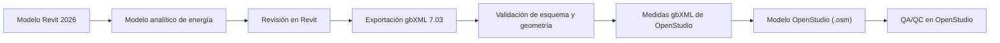

# Intercambio desde Revit

| Campo | Valor |
|---|---|
| Origen | Autodesk Revit 2026 |
| Receptor | OpenStudio 3.11.0 |
| Formato propuesto | gbXML 7.03 |
| Método | Exportación del modelo analítico e importación avanzada |
| Fecha de revisión | 2026-07-15 |
| Estado | Recomendado, pendiente de ensayo reproducible |

## Decisión inicial

La guía adopta provisionalmente **gbXML 7.03** como formato principal para obtener un modelo OpenStudio a partir de Revit 2026.

La decisión se fundamenta en dos capacidades documentadas:

1. Revit 2026 exporta el modelo analítico de energía conforme al esquema gbXML 7.03.
2. El proyecto oficial `gbxml-to-openstudio` desarrolla medidas avanzadas para convertir gbXML en OSM, ampliando la traducción incluida en el SDK.

!!! warning "Estado de la recomendación"
    La existencia de exportador e importador no demuestra que un modelo concreto se transfiera correctamente. La geometría, adyacencias, propiedades y cargas deben verificarse con un caso de prueba versionado.

## Ruta A — gbXML hacia un OSM reutilizable

### Preparación en Revit

1. Registrar la versión exacta de Revit y sus actualizaciones.
2. Definir ubicación, norte y parámetros energéticos.
3. Seleccionar el modo de generación del modelo analítico.
4. Crear y revisar espacios y superficies analíticas.
5. Resolver huecos, solapes, espacios sin cerrar y superficies anómalas.
6. Exportar el modelo analítico a gbXML.

Revit permite generar el modelo analítico a partir de elementos de edificación, habitaciones o espacios, y masas conceptuales combinadas con elementos. La opción elegida forma parte de la evidencia del ensayo.

### Importación en OpenStudio

El ensayo utilizará un flujo OSW que conserve:

- el gbXML original;
- la versión del OpenStudio CLI utilizado;
- las medidas de importación y sus versiones;
- el orden y los argumentos de las medidas;
- el OSM resultante;
- mensajes, advertencias y errores de ejecución.

El OSM generado no se aceptará sin revisar espacios, superficies, sub-superficies, adyacencias, orientación y zonas térmicas.

## Ruta B — Systems Analysis dentro de Revit

Revit 2026 incluye **OpenStudio CLI for Revit** como componente y utiliza flujos de Systems Analysis que traducen datos de Revit, ejecutan EnergyPlus y generan informes.

Esta ruta es válida para realizar los análisis previstos por Autodesk dentro de Revit, pero se documenta separadamente porque:

- su objetivo inmediato es producir una simulación y un informe;
- los flujos pueden utilizar medidas específicas para Revit;
- no debe suponerse que entregan un OSM externo adecuado para continuar el trabajo en otra interfaz;
- la versión exacta del CLI y los artefactos conservados deben comprobarse en la instalación utilizada.

Systems Analysis será objeto de un ensayo complementario. No sustituye automáticamente a la ruta gbXML–OSM.

## Papel de IFC

IFC no se adopta como entrada directa a OpenStudio en esta fase. La documentación oficial revisada acredita el flujo gbXML, mientras que no se ha identificado una ruta oficial equivalente IFC–OSM para el alcance definido.

El IFC puede utilizarse para:

- conservar un intercambio abierto paralelo;
- comparar estructura espacial y geometría;
- rastrear identificadores y propiedades;
- contrastar resultados con CYPE y TeKton3D.

No se considerará sustituto de gbXML hasta disponer de una implementación concreta y de un ensayo reproducible.

## Criterios de aceptación del ensayo

| Control | Evidencia mínima |
|---|---|
| Versión | Revit, exportador, CLI, medidas y OpenStudio registrados |
| Esquema | gbXML válido frente a 7.03 |
| Espacios | Recuento y volúmenes comparados |
| Superficies | Tipos, áreas, inclinaciones y orientación comparados |
| Adyacencias | Cerramientos interiores y exteriores revisados |
| Huecos | Recuento, hospedaje y áreas comparados |
| Propiedades | Construcciones y datos térmicos inventariados |
| OSM | Traducción sin errores bloqueantes y advertencias clasificadas |
| Reproducibilidad | OSW, argumentos, entradas y salidas conservados |

## Fuentes

- [Autodesk: exportación a gbXML en Revit 2026](https://help.autodesk.com/cloudhelp/2026/ESP/Revit-DocumentPresent/files/GUID-586B9574-64DA-47BC-B8EC-DEF2D565928F.htm).
- [Autodesk: flujo de análisis de sistemas de Revit 2026](https://help.autodesk.com/cloudhelp/2026/ESP/Revit-Analyze/files/GUID-200338BB-B394-4492-9A11-1A2A80A45AAE.htm).
- [OpenStudio CLI for Revit Systems Analysis](https://github.com/NatLabRockies/openstudio-revit-releases).
- [Conversión avanzada de gbXML a OpenStudio](https://github.com/NatLabRockies/gbxml-to-openstudio).

## Próximo paso

Preparar un modelo Revit mínimo, ejecutar ambas rutas y registrar las diferencias entre el OSM, el IDF y los informes obtenidos.
