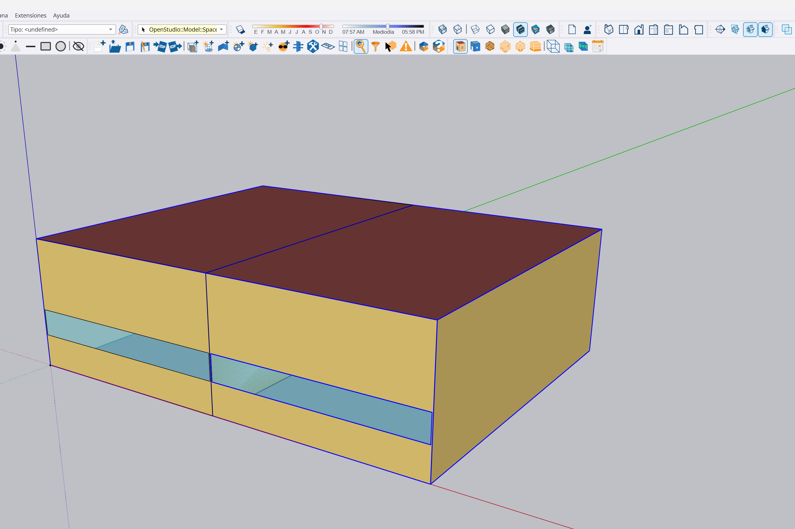

# Validación del modelo mediante SketchUp

Esta página define la validación de ida y vuelta de `OS-MIN-001` mediante OpenStudio SketchUp Plug-in 1.11.0 y SketchUp 2025. El objetivo no es demostrar que los archivos sean textualmente idénticos, sino comprobar que se conservan la geometría, las relaciones y los objetos energéticos relevantes.

## Capas de comprobación

| Capa | Criterio | Resultado BEM-63 |
|---|---|---|
| Apertura visual | Se muestran los dos espacios | Superado por observación del usuario |
| Espacios y zonas | Nombres, áreas, volúmenes y asignaciones | Superado |
| Superficies | Tipo, contorno, área, espacio y condición de contorno | Superado |
| Adyacencias | Dos caras interiores vinculadas entre sí | Superado |
| Huecos | Nombre, tipo, contorno, área y superficie padre | Superado |
| Objetos energéticos | Cargas, infiltración, ventilación, termostatos y cargas ideales | Superado |
| Tipos de objeto | Sin eliminaciones ni adiciones inesperadas | Superado con adiciones admitidas |
| Captura | Imagen de la geometría visible en SketchUp | Superado |

## Evidencia visual



La captura muestra los dos espacios contiguos, la separación central, los dos huecos de ventana y la codificación gráfica por tipo de superficie. También quedan visibles las barras del complemento OpenStudio, por lo que la imagen acredita tanto la carga del OSM como la disponibilidad de las herramientas de revisión.

## Comparador reproducible

Ejecutar desde la raíz del repositorio:

```powershell
C:/openstudioapplication-1.11.1/bin/openstudio.exe `
  examples/openstudio/OS-MIN-001/compare_models.rb `
  examples/openstudio/OS-MIN-001/model.osm `
  tmp/bem-62-sketchup-roundtrip/salida/OS-MIN-001_sketchup.osm `
  tmp/bem-62-sketchup-roundtrip/comparacion.json
```

El comando devuelve código `0` cuando las secciones semánticas coinciden y las diferencias de tipos están expresamente admitidas. Devuelve código distinto de cero si detecta una pérdida o alteración no prevista.

## Diferencias admitidas

El primer guardado desde SketchUp incorporó:

- un `OS:Facility`, objeto organizativo del edificio;
- cinco `OS:Rendering:Color`, utilizados para la representación gráfica.

Estas adiciones no modificaron las magnitudes ni las relaciones incluidas en la matriz de comprobación. Cualquier otra diferencia de recuento hace fallar el comparador y debe registrarse como incidencia antes de continuar.

SketchUp también cambió el vértice inicial de ocho contornos. El comparador normaliza las rotaciones cíclicas antes de comparar, pero conserva el sentido de recorrido: un contorno invertido o con coordenadas distintas seguiría considerándose una alteración.

## Limitaciones del resultado

- La validación se refiere a `OS-MIN-001` y a las versiones documentadas; no generaliza automáticamente a modelos mayores.
- La igualdad geométrica y de objetos no sustituye una simulación EnergyPlus posterior.
- La captura verifica la apariencia general del caso, pero no sustituye la comparación numérica de contornos y relaciones.
- El OSM de salida es un artefacto temporal local; hashes, medidas y resultado cuantificado se conservan en el registro YAML.

## Dictamen

La combinación SketchUp 2025 + OpenStudio SketchUp Plug-in 1.11.0 conserva el caso mínimo dentro del alcance automatizado. El resultado es **compatible para la edición geométrica controlada de `OS-MIN-001`**, con adiciones gráficas conocidas y sin pérdidas detectadas.
