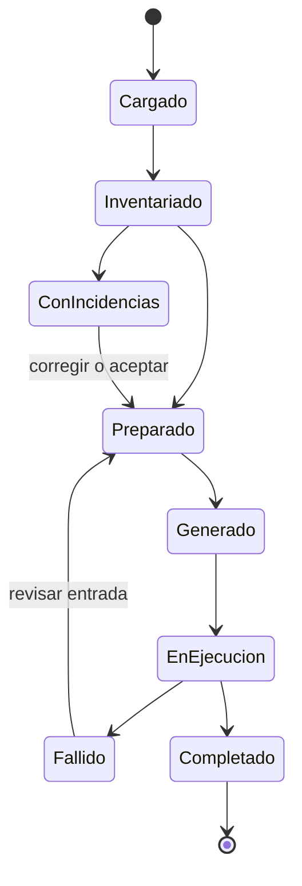

# Arquitectura del MVP gbXML–OpenStudio–EnergyPlus

El objetivo del producto es transformar un gbXML exportado desde Revit en un modelo energético completo, explicable y simulable. El gbXML aporta principalmente geometría y relaciones espaciales; la aplicación valida esa entrada y permite incorporar los datos que falten antes de generar el OSM y ejecutar EnergyPlus.

## Decisión de arquitectura

Se adopta una arquitectura **web-first con integración opcional de Revit**. La lógica energética, las plantillas y la ejecución no residirán dentro del complemento de Revit.

```mermaid
flowchart LR
    RVT["Revit"] -->|"gbXML + metadatos"| API["API de importación"]
    WEB["Aplicación web"] --> API
    API --> PARSER["Parser gbXML"]
    PARSER --> MODEL["Esquema intermedio versionado"]
    MODEL --> QA["QA/QC geométrico"]
    QA --> UI["Enriquecimiento energético"]
    UI --> GEN["Generador OpenStudio"]
    GEN --> OSM["OSM + OSW"]
    OSM --> RUN["Servicio de simulación"]
    RUN --> EP["EnergyPlus"]
    EP --> RESULT["Resultados y diagnóstico"]
    RESULT --> WEB
```

El complemento de Revit será ligero: comprobará requisitos, exportará y adjuntará metadatos que gbXML no conserve bien. La aplicación web también aceptará gbXML cargados manualmente, por lo que el núcleo no dependerá de Revit.

## Alcance de la primera versión

El MVP debe permitir:

1. Cargar un archivo gbXML y conservar su original y su hash.
2. Inventariar edificios, espacios, superficies, huecos, construcciones y unidades.
3. Detectar errores geométricos y relaciones incompletas.
4. Asignar por espacio plantillas de uso, ocupación, iluminación, equipos, infiltración, ventilación, consignas y horarios.
5. Seleccionar clima y una configuración inicial de cargas ideales.
6. Generar un OSM y un OSW reproducibles.
7. Ejecutar OpenStudio y EnergyPlus de forma aislada.
8. Presentar estado, errores, advertencias y resultados principales.
9. Descargar gbXML original, esquema intermedio, OSM, OSW, IDF, logs y resultados.

## Fuera del MVP

- Edición BIM general o sustitución de Revit.
- Cálculo reglamentario oficial o certificación energética.
- Biblioteca completa de todos los sistemas HVAC posibles.
- Dimensionado detallado de redes hidráulicas y conductos.
- Colaboración multiusuario avanzada, facturación o explotación comercial.
- Corrección automática de cualquier geometría defectuosa.

Estas capacidades podrán incorporarse después de validar el flujo básico con casos reales.

## Componentes y responsabilidades

| Componente | Responsabilidad | No debe hacer |
|---|---|---|
| Complemento Revit | Prevalidar, exportar y adjuntar trazabilidad | Ejecutar el motor energético completo |
| Interfaz web | Guiar la revisión y captura de datos | Interpretar directamente los detalles internos de OpenStudio |
| API | Coordinar proyectos, versiones y trabajos | Ejecutar simulaciones dentro del proceso web |
| Parser gbXML | Normalizar entrada y preservar identificadores | Inventar datos energéticos sin marcar su procedencia |
| Esquema intermedio | Contrato estable entre módulos | Depender del formato interno de la interfaz |
| Generador OSM | Traducir datos validados a OpenStudio | Corregir silenciosamente inconsistencias |
| Servicio de simulación | Ejecutar trabajos aislados y conservar logs | Aceptar entradas sin versión ni límites |
| Procesador de resultados | Extraer indicadores y diagnóstico | Ocultar advertencias o errores del motor |

## Principios de trazabilidad

Cada dato energético debe indicar si procede de:

- gbXML/Revit;
- una plantilla seleccionada;
- una inferencia de la aplicación;
- una modificación manual del usuario.

Cada simulación debe registrar versiones de la aplicación, esquema, OpenStudio, EnergyPlus, clima y plantillas, además de hashes de las entradas. Nunca se sobrescribirá el gbXML original ni una simulación previa.

## Flujo de estados

## Criterios de éxito del MVP

- Un caso Revit controlado completa el flujo sin edición manual del OSM.
- Las pérdidas geométricas se detectan y quedan explicadas.
- Los datos ausentes pueden completarse mediante un formulario y plantillas.
- La misma entrada versionada produce un OSM reproducible.
- EnergyPlus termina sin errores severos atribuibles a la aplicación.
- Los resultados pueden vincularse a sus entradas, versiones y logs.

## Backlog asociado

El épico Jira **BEM-64** agrupa BEM-65 a BEM-76: arquitectura, esquema intermedio, parser, QA/QC, plantillas, climatización, generación OSM, ejecución, resultados, web, complemento Revit y validación integral.
