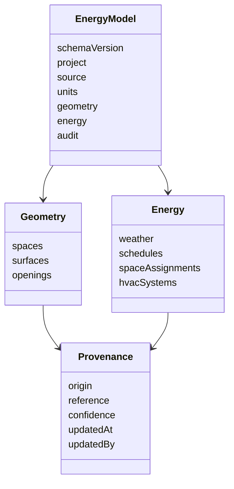

# Esquema intermedio de datos energéticos

El esquema intermedio es el contrato entre la importación gbXML, la interfaz web y el generador OpenStudio. Evita que la lógica del producto dependa directamente de la estructura XML de Revit o de los objetos internos del OSM.

## Artefactos

| Artefacto | Función |
|---|---|
| `schemas/bem-energy-model.schema.json` | JSON Schema 2020-12, versión 0.1.0 |
| `examples/producto/modelo-intermedio-minimo.json` | Documento mínimo validable |
| `scripts/validate_energy_schema.py` | Validador de esquema y formatos |

Validación desde la raíz del repositorio:

```powershell
python scripts/validate_energy_schema.py `
  examples/producto/modelo-intermedio-minimo.json
```

## Estructura principal



## Procedencia obligatoria

Los valores energéticos no se almacenan como números o textos aislados. Cada uno incorpora `provenance` con uno de estos orígenes:

| Origen | Significado |
|---|---|
| `gbxml` | Leído directamente del archivo importado |
| `revit_metadata` | Enviado como metadato adicional por el complemento |
| `template` | Aplicado desde una plantilla identificada y versionada |
| `inferred` | Calculado o supuesto por la aplicación; puede incluir confianza |
| `user` | Introducido o confirmado expresamente por el usuario |

Esta distinción impide presentar un valor supuesto como si procediera del modelo BIM y permite explicar cómo se construyó cada simulación.

## Geometría

El bloque `geometry` contiene:

- espacios con identificador interno y `sourceId` del gbXML;
- superficies con tipo, condición de contorno, espacios relacionados y vértices 3D;
- huecos vinculados a su superficie padre;
- referencias opcionales a niveles, zonas térmicas y construcciones.

Todas las coordenadas se normalizan a metros. El esquema valida la forma del documento; la comprobación de cerramiento, coplanaridad, adyacencias y duplicados corresponde al QA/QC geométrico de BEM-68.

## Datos energéticos

Cada asignación de espacio puede declarar:

- tipo de uso;
- densidad de ocupación;
- potencia de iluminación y equipos;
- infiltración;
- ventilación por persona y por superficie;
- consignas de calefacción y refrigeración;
- referencias a horarios y sistema HVAC.

Los horarios diarios contienen 24 valores. La primera versión admite cargas ideales y reserva tipos para bomba de calor, caldera/enfriadora, VRF y otros sistemas. La definición física detallada de climatización se desarrollará en BEM-70.

## Auditoría y versionado

El documento conserva el nombre y SHA-256 del gbXML original, versión de Revit cuando exista, fecha de importación, revisión y estado. El contrato 0.1.0 no se modificará de forma incompatible sin aumentar su versión y proporcionar una migración.

## Límites de esta versión

- El esquema define referencias a construcciones, pero todavía no desarrolla sus capas y materiales.
- No expresa aún calendarios anuales, festivos ni excepciones horarias.
- Los sistemas HVAC distintos de cargas ideales necesitan subesquemas específicos.
- JSON Schema no comprueba por sí solo que todos los identificadores referenciados existan; esa validación semántica se implementará junto al parser y el QA/QC.

El ejemplo mínimo demuestra el contrato, no constituye un edificio geométricamente cerrado ni un modelo listo para simular.
