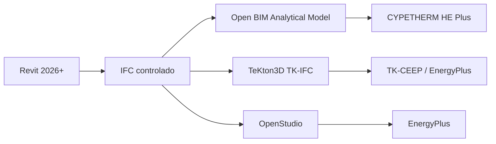

# Guía de preparación de modelos BIM para análisis energético

Este manual establece criterios para preparar modelos geométricos en Autodesk Revit, intercambiarlos mediante IFC y transformarlos en modelos analíticos adecuados para herramientas de análisis y certificación energética.

## Flujos iniciales

!!! warning "Documento en elaboración"
    La versión `0.1.0` define la arquitectura documental. Las recomendaciones técnicas se incorporarán progresivamente y deberán indicar evidencia, versiones y estado de validación.

## Principios

1. El modelo destinado al cálculo no tiene que reproducir todo el detalle documental.
2. La continuidad espacial y la envolvente tienen prioridad sobre el detalle gráfico.
3. La exportación IFC debe responder a un uso definido.
4. Todo resultado automático requiere validación técnica.
5. Las reglas comunes se separan de las limitaciones de cada aplicación.

